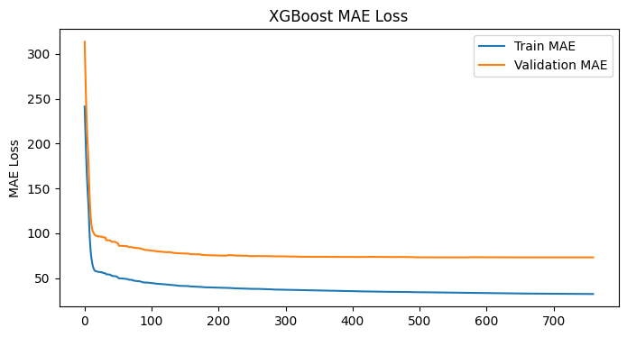
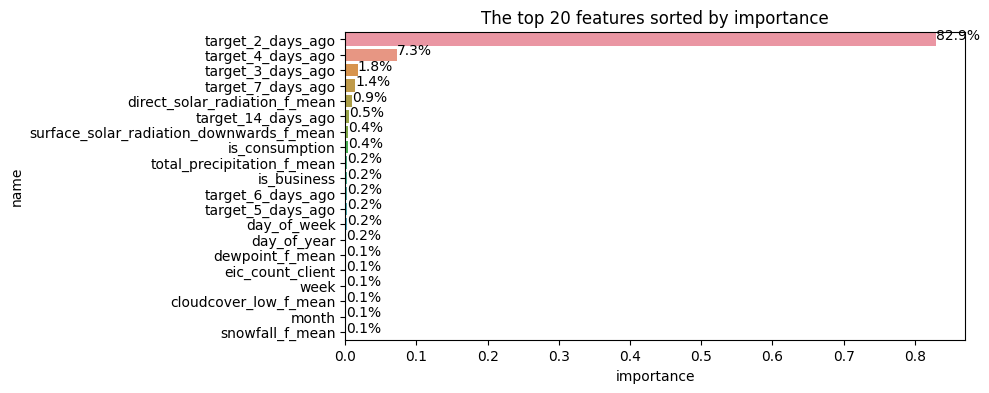

# Notebook relevant version changes

<div style="border-radius:10px; border: #babab5 solid; padding: 15px; background-color: #e6f9ff; font-size:100%;">
   
* V11 (CV 1-fold: 90.76 / LB: 97.66)
    * Create feature processing per dataset inside the  class FeatureProcessorClass
    * Renaming of the features per dataset
    * Remove latitude/longitude columns for model
    * Add mean_price_per_mwh_gas as feature


* V21 (CV 1-fold: 78.99 / LB: 86.43)
    * Add revealed_target lags from 2 to 7 days ago - inspired from [[Enefit] Baseline + cross-validation ☀️](https://www.kaggle.com/code/vincentschuler/enefit-baseline-cross-validation)
    * Use custom N_days_lags to specify the max number of revealed_target day lags

    
* V23 (CV 1-fold: 72.96 / LB: 83.79)
    * Map latitude & longitude for each county, using code from [mapping locations and county codes
](https://www.kaggle.com/code/fabiendaniel/mapping-locations-and-county-codes)
    * *historical_weather* and *forecast_weather* group by county too, and specify aggegate statistics  

# Introduction 
> 📌**Note**: If you liked or forked this notebook, please consider upvoting ⬆️⬆️ It encourages to keep posting relevant content

<div style="border-radius:10px; border: #babab5 solid; padding: 15px; background-color: #e6f9ff; font-size:100%; ">
    
This notebook covers the following:
* Pre-processing of the different datasets 
* Basic merging of the datasets 
* Simple feature engineering
* XGBoost starter model 
* Next steps

# Competition Description


> 📌**Note**:  Energy prosumers are individuals, businesses, or organizations that both consume and produce energy. This concept represents a shift from the traditional model where consumers simply purchase energy from utilities and rely on centralized power generation sources. Energy prosumers are actively involved in the energy ecosystem by generating their own electricity, typically through renewable energy sources like solar panels (or wind turbines, small-scale hydropower etc.). They also consume energy from the grid when their own generation is insufficient to meet their needs

<div style="border-radius:10px; border: #babab5 solid; padding: 15px; background-color: #e6f9ff; font-size:100%; ">
    
* The number of prosumers is rapidly increasing, associated with higher energy imbalance - increased operational costs, potential grid instability, and inefficient use of energy resources.
* The goal of the competition is to create an energy prediction model of prosumers to reduce energy imbalance costs
* If solved, it would reduce the imbalance costs, improve the reliability of the grid, and make the integration of prosumers into the energy system more efficient and sustainable.
*  Moreover, it could potentially incentivize more consumers to become prosumers and thus promote renewable energy production and use.

# Data Description
> 📌**Note**:  Your challenge in this competition is to predict the amount of electricity produced and consumed by Estonian energy customers who have installed solar panels. You'll have access to weather data, the relevant energy prices, and records of the installed photovoltaic capacity. <br> <br>
This is a forecasting competition using the time series API. The private leaderboard will be determined using real data gathered after the submission period closes.

<div style="border-radius:10px; border: #babab5 solid; padding: 15px; background-color: #e6f9ff; font-size:100%; ">

## Files

**train.csv**

- `county` - An ID code for the county.
- `is_business` - Boolean for whether or not the prosumer is a business.
- `product_type` - ID code with the following mapping of codes to contract types: `{0: "Combined", 1: "Fixed", 2: "General service", 3: "Spot"}`.
- `target` - The consumption or production amount for the relevant segment for the hour. The segments are defined by the `county`, `is_business`, and `product_type`.
- `is_consumption` - Boolean for whether or not this row's target is consumption or production.
- `datetime` - The Estonian time in EET (UTC+2) / EEST (UTC+3).
- `data_block_id` - All rows sharing the same `data_block_id` will be available at the same forecast time. This is a function of what information is available when forecasts are actually made, at 11 AM each morning. For example, if the forecast weather `data_block_id` for predictions made on October 31st is 100 then the historic weather `data_block_id` for October 31st will be 101 as the historic weather data is only actually available the next day.
- `row_id` - A unique identifier for the row.
- `prediction_unit_id` - A unique identifier for the `county`, `is_business`, and `product_type` combination. _New prediction units can appear or dissappear in the test set_.

**gas\_prices.csv**

- `origin_date` - The date when the day-ahead prices became available.
- `forecast_date` - The date when the forecast prices should be relevant.
- `[lowest/highest]_price_per_mwh` - The lowest/highest price of natural gas that on the day ahead market that trading day, in Euros per megawatt hour equivalent.
- `data_block_id`

**client.csv**

- `product_type`
- `county` - An ID code for the county. See `county_id_to_name_map.json` for the mapping of ID codes to county names.
- `eic_count` - The aggregated number of consumption points (EICs - European Identifier Code).
- `installed_capacity` - Installed photovoltaic solar panel capacity in kilowatts.
- `is_business` - Boolean for whether or not the prosumer is a business.
- `date`
- `data_block_id`

**electricity\_prices.csv**

- `origin_date`
- `forecast_date`
- `euros_per_mwh` - The price of electricity on the day ahead markets in euros per megawatt hour.
- `data_block_id`

**forecast\_weather.csv** Weather forecasts that would have been available at prediction time. Sourced from the [European Centre for Medium-Range Weather Forecasts](https://codes.ecmwf.int/grib/param-db/?filter=grib2).

- `[latitude/longitude]` - The coordinates of the weather forecast.
- `origin_datetime` - The timestamp of when the forecast was generated.
- `hours_ahead` - The number of hours between the forecast generation and the forecast weather. Each forecast covers 48 hours in total.
- `temperature` - The air temperature at 2 meters above ground in degrees Celsius.
- `dewpoint` - The dew point temperature at 2 meters above ground in degrees Celsius.
- `cloudcover_[low/mid/high/total]` - The percentage of the sky covered by clouds in the following altitude bands: 0-2 km, 2-6, 6+, and total.
- `10_metre_[u/v]_wind_component` - The \[eastward/northward\] component of wind speed measured 10 meters above surface in meters per second.
- `data_block_id`
- `forecast_datetime` - The timestamp of the predicted weather. Generated from `origin_datetime` plus `hours_ahead`.
- `direct_solar_radiation` - The direct solar radiation reaching the surface on a plane perpendicular to the direction of the Sun accumulated during the preceding hour, in watt-hours per square meter.
- `surface_solar_radiation_downwards` - The solar radiation, both direct and diffuse, that reaches a horizontal plane at the surface of the Earth, in watt-hours per square meter.
- `snowfall` - Snowfall over the previous hour in units of meters of water equivalent.
- `total_precipitation` - The accumulated liquid, comprising rain and snow that falls on Earth's surface over the preceding hour, in units of meters.

**historical\_weather.csv** [Historic weather data](https://open-meteo.com/en/docs).

- `datetime`
- `temperature`
- `dewpoint`
- `rain` - Different from the forecast conventions. The rain from large scale weather systems of the preceding hour in millimeters.
- `snowfall` - Different from the forecast conventions. Snowfall over the preceding hour in centimeters.
- `surface_pressure` - The air pressure at surface in hectopascals.
- `cloudcover_[low/mid/high/total]` - Different from the forecast conventions. Cloud cover at 0-3 km, 3-8, 8+, and total.
- `windspeed_10m` - Different from the forecast conventions. The wind speed at 10 meters above ground in meters per second.
- `winddirection_10m` - Different from the forecast conventions. The wind direction at 10 meters above ground in degrees.
- `shortwave_radiation` - Different from the forecast conventions. The global horizontal irradiation in watt-hours per square meter.
- `direct_solar_radiation`
- `diffuse_radiation` - Different from the forecast conventions. The diffuse solar irradiation in watt-hours per square meter.
- `[latitude/longitude]` - The coordinates of the weather station.
- `data_block_id`

**public\_timeseries\_testing\_util.py** An optional file intended to make it easier to run custom offline API tests. See the script's docstring for details. You will need to edit this file before using it.

**example\_test\_files/** Data intended to illustrate how the API functions. Includes the same files and columns delivered by the API. The first three `data_block_ids` are repeats of the last three `data_block_ids` in the train set.

**example\_test\_files/sample\_submission.csv** A valid sample submission, delivered by the API. See [this notebook](https://www.kaggle.com/code/sohier/enefit-basic-submission-demo/notebook) for a very simple example of how to use the sample submission.

**example\_test\_files/revealed\_targets.csv** The actual target values, served with a lag of one day.

**enefit/** Files that enable the API. Expect the API to deliver all rows in under 15 minutes and to reserve less than 0.5 GB of memory. The copy of the API that you can download serves the data from **example\_test\_files/**. You must make predictions for those dates in order to advance the API but those predictions are not scored. Expect to see roughly three months of data delivered initially and up to ten months of data by the end of the forecasting period.

# Install & imports


```python
!pip install -U xgboost -f /kaggle/input/xgboost-python-package/ --no-index
```

    Looking in links: /kaggle/input/xgboost-python-package/
    Requirement already satisfied: xgboost in /opt/conda/lib/python3.10/site-packages (1.7.6)
    Processing /kaggle/input/xgboost-python-package/xgboost-2.0.1-py3-none-manylinux2014_x86_64.whl
    Requirement already satisfied: numpy in /opt/conda/lib/python3.10/site-packages (from xgboost) (1.23.5)
    Requirement already satisfied: scipy in /opt/conda/lib/python3.10/site-packages (from xgboost) (1.11.2)
    Installing collected packages: xgboost
      Attempting uninstall: xgboost
        Found existing installation: xgboost 1.7.6
        Uninstalling xgboost-1.7.6:
          Successfully uninstalled xgboost-1.7.6
    Successfully installed xgboost-2.0.1
    


```python
import pandas as pd
import numpy as np
import json
```


```python
#General
import pandas as pd
import numpy as np
import json

# Visualization
import seaborn as sns
import matplotlib.pyplot as plt
from colorama import Fore, Style, init;

# Modeling
import xgboost as xgb
import lightgbm as lgb
import torch

# Geolocation
from geopy.geocoders import Nominatim

# Options
pd.set_option('display.max_columns', 100)
```


```python
DEBUG = False # False/True
```


```python
# GPU or CPU use for model
if torch.cuda.is_available():
    device = 'cuda'
else:
    device = 'cpu'
```


```python
# Helper functions
def display_df(df, name):
    '''Display df shape and first row '''
    PrintColor(text = f'{name} data has {df.shape[0]} rows and {df.shape[1]} columns. \n ===> First row:')
    display(df.head(1))

# Color printing    
def PrintColor(text:str, color = Fore.BLUE, style = Style.BRIGHT):
    '''Prints color outputs using colorama of a text string'''
    print(style + color + text + Style.RESET_ALL); 
```


```python
DATA_DIR = "/kaggle/input/predict-energy-behavior-of-prosumers/"

# Read CSVs and parse relevant date columns
train = pd.read_csv(DATA_DIR + "train.csv")
client = pd.read_csv(DATA_DIR + "client.csv")
historical_weather = pd.read_csv(DATA_DIR + "historical_weather.csv")
forecast_weather = pd.read_csv(DATA_DIR + "forecast_weather.csv")
electricity = pd.read_csv(DATA_DIR + "electricity_prices.csv")
gas = pd.read_csv(DATA_DIR + "gas_prices.csv")
```


```python
# Location from https://www.kaggle.com/datasets/michaelo/fabiendaniels-mapping-locations-and-county-codes/data
location = (pd.read_csv("/kaggle/input/fabiendaniels-mapping-locations-and-county-codes/county_lon_lats.csv")
            .drop(columns = ["Unnamed: 0"])
           )
```

    train data has 2018352 rows and 9 columns. 
     ===> First row:
    


<div>
<style scoped>
    .dataframe tbody tr th:only-of-type {
        vertical-align: middle;
    }

    .dataframe tbody tr th {
        vertical-align: top;
    }

    .dataframe thead th {
        text-align: right;
    }
</style>
<table border="1" class="dataframe">
  <thead>
    <tr style="text-align: right;">
      <th></th>
      <th>county</th>
      <th>is_business</th>
      <th>product_type</th>
      <th>target</th>
      <th>is_consumption</th>
      <th>datetime</th>
      <th>data_block_id</th>
      <th>row_id</th>
      <th>prediction_unit_id</th>
    </tr>
  </thead>
  <tbody>
    <tr>
      <th>0</th>
      <td>0</td>
      <td>0</td>
      <td>1</td>
      <td>0.713</td>
      <td>0</td>
      <td>2021-09-01 00:00:00</td>
      <td>0</td>
      <td>0</td>
      <td>0</td>
    </tr>
  </tbody>
</table>
</div>


    client data has 41919 rows and 7 columns. 
     ===> First row:
    


<div>
<style scoped>
    .dataframe tbody tr th:only-of-type {
        vertical-align: middle;
    }

    .dataframe tbody tr th {
        vertical-align: top;
    }

    .dataframe thead th {
        text-align: right;
    }
</style>
<table border="1" class="dataframe">
  <thead>
    <tr style="text-align: right;">
      <th></th>
      <th>product_type</th>
      <th>county</th>
      <th>eic_count</th>
      <th>installed_capacity</th>
      <th>is_business</th>
      <th>date</th>
      <th>data_block_id</th>
    </tr>
  </thead>
  <tbody>
    <tr>
      <th>0</th>
      <td>1</td>
      <td>0</td>
      <td>108</td>
      <td>952.89</td>
      <td>0</td>
      <td>2021-09-01</td>
      <td>2</td>
    </tr>
  </tbody>
</table>
</div>


    historical weather data has 1710800 rows and 18 columns. 
     ===> First row:
    


<div>
<style scoped>
    .dataframe tbody tr th:only-of-type {
        vertical-align: middle;
    }

    .dataframe tbody tr th {
        vertical-align: top;
    }

    .dataframe thead th {
        text-align: right;
    }
</style>
<table border="1" class="dataframe">
  <thead>
    <tr style="text-align: right;">
      <th></th>
      <th>datetime</th>
      <th>temperature</th>
      <th>dewpoint</th>
      <th>rain</th>
      <th>snowfall</th>
      <th>surface_pressure</th>
      <th>cloudcover_total</th>
      <th>cloudcover_low</th>
      <th>cloudcover_mid</th>
      <th>cloudcover_high</th>
      <th>windspeed_10m</th>
      <th>winddirection_10m</th>
      <th>shortwave_radiation</th>
      <th>direct_solar_radiation</th>
      <th>diffuse_radiation</th>
      <th>latitude</th>
      <th>longitude</th>
      <th>data_block_id</th>
    </tr>
  </thead>
  <tbody>
    <tr>
      <th>0</th>
      <td>2021-09-01 00:00:00</td>
      <td>14.4</td>
      <td>12.0</td>
      <td>0.0</td>
      <td>0.0</td>
      <td>1015.8</td>
      <td>4</td>
      <td>4</td>
      <td>0</td>
      <td>0</td>
      <td>6.694444</td>
      <td>3</td>
      <td>0.0</td>
      <td>0.0</td>
      <td>0.0</td>
      <td>57.6</td>
      <td>21.7</td>
      <td>1</td>
    </tr>
  </tbody>
</table>
</div>


    forecast weather data has 3424512 rows and 18 columns. 
     ===> First row:
    


<div>
<style scoped>
    .dataframe tbody tr th:only-of-type {
        vertical-align: middle;
    }

    .dataframe tbody tr th {
        vertical-align: top;
    }

    .dataframe thead th {
        text-align: right;
    }
</style>
<table border="1" class="dataframe">
  <thead>
    <tr style="text-align: right;">
      <th></th>
      <th>latitude</th>
      <th>longitude</th>
      <th>origin_datetime</th>
      <th>hours_ahead</th>
      <th>temperature</th>
      <th>dewpoint</th>
      <th>cloudcover_high</th>
      <th>cloudcover_low</th>
      <th>cloudcover_mid</th>
      <th>cloudcover_total</th>
      <th>10_metre_u_wind_component</th>
      <th>10_metre_v_wind_component</th>
      <th>data_block_id</th>
      <th>forecast_datetime</th>
      <th>direct_solar_radiation</th>
      <th>surface_solar_radiation_downwards</th>
      <th>snowfall</th>
      <th>total_precipitation</th>
    </tr>
  </thead>
  <tbody>
    <tr>
      <th>0</th>
      <td>57.6</td>
      <td>21.7</td>
      <td>2021-09-01 00:00:00+00:00</td>
      <td>1</td>
      <td>15.655786</td>
      <td>11.553613</td>
      <td>0.904816</td>
      <td>0.019714</td>
      <td>0.0</td>
      <td>0.905899</td>
      <td>-0.411328</td>
      <td>-9.106137</td>
      <td>1</td>
      <td>2021-09-01 01:00:00+00:00</td>
      <td>0.0</td>
      <td>0.0</td>
      <td>0.0</td>
      <td>0.0</td>
    </tr>
  </tbody>
</table>
</div>


    electricity prices data has 15286 rows and 4 columns. 
     ===> First row:
    


<div>
<style scoped>
    .dataframe tbody tr th:only-of-type {
        vertical-align: middle;
    }

    .dataframe tbody tr th {
        vertical-align: top;
    }

    .dataframe thead th {
        text-align: right;
    }
</style>
<table border="1" class="dataframe">
  <thead>
    <tr style="text-align: right;">
      <th></th>
      <th>forecast_date</th>
      <th>euros_per_mwh</th>
      <th>origin_date</th>
      <th>data_block_id</th>
    </tr>
  </thead>
  <tbody>
    <tr>
      <th>0</th>
      <td>2021-09-01 00:00:00</td>
      <td>92.51</td>
      <td>2021-08-31 00:00:00</td>
      <td>1</td>
    </tr>
  </tbody>
</table>
</div>


    gas prices data has 637 rows and 5 columns. 
     ===> First row:
    


<div>
<style scoped>
    .dataframe tbody tr th:only-of-type {
        vertical-align: middle;
    }

    .dataframe tbody tr th {
        vertical-align: top;
    }

    .dataframe thead th {
        text-align: right;
    }
</style>
<table border="1" class="dataframe">
  <thead>
    <tr style="text-align: right;">
      <th></th>
      <th>forecast_date</th>
      <th>lowest_price_per_mwh</th>
      <th>highest_price_per_mwh</th>
      <th>origin_date</th>
      <th>data_block_id</th>
    </tr>
  </thead>
  <tbody>
    <tr>
      <th>0</th>
      <td>2021-09-01</td>
      <td>45.23</td>
      <td>46.32</td>
      <td>2021-08-31</td>
      <td>1</td>
    </tr>
  </tbody>
</table>
</div>


    location data data has 75 rows and 3 columns. 
     ===> First row:
    


<div>
<style scoped>
    .dataframe tbody tr th:only-of-type {
        vertical-align: middle;
    }

    .dataframe tbody tr th {
        vertical-align: top;
    }

    .dataframe thead th {
        text-align: right;
    }
</style>
<table border="1" class="dataframe">
  <thead>
    <tr style="text-align: right;">
      <th></th>
      <th>county</th>
      <th>longitude</th>
      <th>latitude</th>
    </tr>
  </thead>
  <tbody>
    <tr>
      <th>0</th>
      <td>0</td>
      <td>24.2</td>
      <td>59.1</td>
    </tr>
  </tbody>
</table>
</div>


```python
display_df(train, 'train')
display_df(client, 'client')
display_df(historical_weather, 'historical weather')
display_df(forecast_weather, 'forecast weather')
display_df(electricity, 'electricity prices')
display_df(gas, 'gas prices')
display_df(location, 'location data')
```


<div>
<style scoped>
    .dataframe tbody tr th:only-of-type {
        vertical-align: middle;
    }

    .dataframe tbody tr th {
        vertical-align: top;
    }

    .dataframe thead th {
        text-align: right;
    }
</style>
<table border="1" class="dataframe">
  <thead>
    <tr style="text-align: right;">
      <th></th>
      <th>0</th>
      <th>1</th>
      <th>2</th>
      <th>3</th>
      <th>4</th>
      <th>5</th>
      <th>6</th>
      <th>7</th>
      <th>8</th>
      <th>9</th>
      <th>10</th>
      <th>11</th>
      <th>12</th>
      <th>13</th>
      <th>14</th>
      <th>15</th>
    </tr>
  </thead>
  <tbody>
    <tr>
      <th>0</th>
      <td>HARJUMAA</td>
      <td>HIIUMAA</td>
      <td>IDA-VIRUMAA</td>
      <td>JÄRVAMAA</td>
      <td>JÕGEVAMAA</td>
      <td>LÄÄNE-VIRUMAA</td>
      <td>LÄÄNEMAA</td>
      <td>PÄRNUMAA</td>
      <td>PÕLVAMAA</td>
      <td>RAPLAMAA</td>
      <td>SAAREMAA</td>
      <td>TARTUMAA</td>
      <td>UNKNOWN</td>
      <td>VALGAMAA</td>
      <td>VILJANDIMAA</td>
      <td>VÕRUMAA</td>
    </tr>
  </tbody>
</table>
</div>


```python
# See county codes
with open(DATA_DIR + 'county_id_to_name_map.json') as f:
    county_codes = json.load(f)
pd.DataFrame(county_codes, index=[0])
```


<div>
<style scoped>
    .dataframe tbody tr th:only-of-type {
        vertical-align: middle;
    }

    .dataframe tbody tr th {
        vertical-align: top;
    }

    .dataframe thead th {
        text-align: right;
    }
</style>
<table border="1" class="dataframe">
  <thead>
    <tr style="text-align: right;">
      <th></th>
      <th>count</th>
      <th>mean</th>
      <th>std</th>
      <th>min</th>
      <th>0%</th>
      <th>0.1%</th>
      <th>1%</th>
      <th>5%</th>
      <th>10%</th>
      <th>25%</th>
      <th>50%</th>
      <th>75%</th>
      <th>90%</th>
      <th>95%</th>
      <th>99%</th>
      <th>99.9%</th>
      <th>max</th>
    </tr>
  </thead>
  <tbody>
    <tr>
      <th>target</th>
      <td>1008912.0</td>
      <td>460.71</td>
      <td>1198.95</td>
      <td>0.0</td>
      <td>0.0</td>
      <td>0.28</td>
      <td>1.86</td>
      <td>6.42</td>
      <td>12.0</td>
      <td>34.51</td>
      <td>108.9</td>
      <td>386.97</td>
      <td>972.05</td>
      <td>1567.52</td>
      <td>7141.02</td>
      <td>12369.16</td>
      <td>15480.27</td>
    </tr>
  </tbody>
</table>
</div>


```python
# pd.DataFrame(train[train['is_consumption']==0].target.describe(percentiles = [0, 0.001, 0.01, 0.05, 0.1, 0.25, 0.5, 0.75, 0.9, 0.95, 0.99, 0.999])).round(2).T
# pd.DataFrame(train[train['is_consumption']==1].target.describe(percentiles = [0, 0.001, 0.01, 0.05, 0.1, 0.25, 0.5, 0.75, 0.9, 0.95, 0.99, 0.999])).round(2).T
```

# Data processing


```python
class FeatureProcessorClass():
    def __init__(self):         
        # Columns to join on for the different datasets
        self.weather_join = ['datetime', 'county', 'data_block_id']
        self.gas_join = ['data_block_id']
        self.electricity_join = ['datetime', 'data_block_id']
        self.client_join = ['county', 'is_business', 'product_type', 'data_block_id']
        
        # Columns of latitude & longitude
        self.lat_lon_columns = ['latitude', 'longitude']
        
        # Aggregate stats 
        self.agg_stats = ['mean'] #, 'min', 'max', 'std', 'median']
        
        # Categorical columns (specify for XGBoost)
        self.category_columns = ['county', 'is_business', 'product_type', 'is_consumption', 'data_block_id']

    def create_new_column_names(self, df, suffix, columns_no_change):
        '''Change column names by given suffix, keep columns_no_change, and return back the data'''
        df.columns = [col + suffix 
                      if col not in columns_no_change
                      else col
                      for col in df.columns
                      ]
        return df 

    def flatten_multi_index_columns(self, df):
        df.columns = ['_'.join([col for col in multi_col if len(col)>0]) 
                      for multi_col in df.columns]
        return df
    
    def create_data_features(self, data):
        '''📊Create features for main data (test or train) set📊'''
        # To datetime
        data['datetime'] = pd.to_datetime(data['datetime'])
        
        # Time period features
        data['date'] = data['datetime'].dt.normalize()
        data['year'] = data['datetime'].dt.year
        data['quarter'] = data['datetime'].dt.quarter
        data['month'] = data['datetime'].dt.month
        data['week'] = data['datetime'].dt.isocalendar().week
        data['hour'] = data['datetime'].dt.hour
        
        # Day features
        data['day_of_year'] = data['datetime'].dt.day_of_year
        data['day_of_month']  = data['datetime'].dt.day
        data['day_of_week'] = data['datetime'].dt.day_of_week
        return data

    def create_client_features(self, client):
        '''💼 Create client features 💼'''
        # Modify column names - specify suffix
        client = self.create_new_column_names(client, 
                                           suffix='_client',
                                           columns_no_change = self.client_join
                                          )       
        return client
    
    def create_historical_weather_features(self, historical_weather):
        '''⌛🌤️ Create historical weather features 🌤️⌛'''
        
        # To datetime
        historical_weather['datetime'] = pd.to_datetime(historical_weather['datetime'])
        
        # Add county
        historical_weather[self.lat_lon_columns] = historical_weather[self.lat_lon_columns].astype(float).round(1)
        historical_weather = historical_weather.merge(location, how = 'left', on = self.lat_lon_columns)

        # Modify column names - specify suffix
        historical_weather = self.create_new_column_names(historical_weather,
                                                          suffix='_h',
                                                          columns_no_change = self.lat_lon_columns + self.weather_join
                                                          ) 
        
        # Group by & calculate aggregate stats 
        agg_columns = [col for col in historical_weather.columns if col not in self.lat_lon_columns + self.weather_join]
        agg_dict = {agg_col: self.agg_stats for agg_col in agg_columns}
        historical_weather = historical_weather.groupby(self.weather_join).agg(agg_dict).reset_index() 
        
        # Flatten the multi column aggregates
        historical_weather = self.flatten_multi_index_columns(historical_weather) 
        
        # Test set has 1 day offset for hour<11 and 2 day offset for hour>11
        historical_weather['hour_h'] = historical_weather['datetime'].dt.hour
        historical_weather['datetime'] = (historical_weather
                                               .apply(lambda x: 
                                                      x['datetime'] + pd.DateOffset(1) 
                                                      if x['hour_h']< 11 
                                                      else x['datetime'] + pd.DateOffset(2),
                                                      axis=1)
                                              )
        
        return historical_weather
    
    def create_forecast_weather_features(self, forecast_weather):
        '''🔮🌤️ Create forecast weather features 🌤️🔮'''
        
        # Rename column and drop
        forecast_weather = (forecast_weather
                            .rename(columns = {'forecast_datetime': 'datetime'})
                            .drop(columns = 'origin_datetime') # not needed
                           )
        
        # To datetime
        forecast_weather['datetime'] = (pd.to_datetime(forecast_weather['datetime'])
                                        .dt
                                        .tz_convert('Europe/Brussels') # change to different time zone?
                                        .dt
                                        .tz_localize(None)
                                       )

        # Add county
        forecast_weather[self.lat_lon_columns] = forecast_weather[self.lat_lon_columns].astype(float).round(1)
        forecast_weather = forecast_weather.merge(location, how = 'left', on = self.lat_lon_columns)
        
        # Modify column names - specify suffix
        forecast_weather = self.create_new_column_names(forecast_weather,
                                                        suffix='_f',
                                                        columns_no_change = self.lat_lon_columns + self.weather_join
                                                        ) 
        
        # Group by & calculate aggregate stats 
        agg_columns = [col for col in forecast_weather.columns if col not in self.lat_lon_columns + self.weather_join]
        agg_dict = {agg_col: self.agg_stats for agg_col in agg_columns}
        forecast_weather = forecast_weather.groupby(self.weather_join).agg(agg_dict).reset_index() 
        
        # Flatten the multi column aggregates
        forecast_weather = self.flatten_multi_index_columns(forecast_weather)     
        return forecast_weather

    def create_electricity_features(self, electricity):
        '''⚡ Create electricity prices features ⚡'''
        # To datetime
        electricity['forecast_date'] = pd.to_datetime(electricity['forecast_date'])
        
        # Test set has 1 day offset
        electricity['datetime'] = electricity['forecast_date'] + pd.DateOffset(1)
        
        # Modify column names - specify suffix
        electricity = self.create_new_column_names(electricity, 
                                                   suffix='_electricity',
                                                   columns_no_change = self.electricity_join
                                                  )             
        return electricity

    def create_gas_features(self, gas):
        '''⛽ Create gas prices features ⛽'''
        # Mean gas price
        gas['mean_price_per_mwh'] = (gas['lowest_price_per_mwh'] + gas['highest_price_per_mwh'])/2
        
        # Modify column names - specify suffix
        gas = self.create_new_column_names(gas, 
                                           suffix='_gas',
                                           columns_no_change = self.gas_join
                                          )       
        return gas
    
    def __call__(self, data, client, historical_weather, forecast_weather, electricity, gas):
        '''Processing of features from all datasets, merge together and return features for dataframe df '''
        # Create features for relevant dataset
        data = self.create_data_features(data)
        client = self.create_client_features(client)
        historical_weather = self.create_historical_weather_features(historical_weather)
        forecast_weather = self.create_forecast_weather_features(forecast_weather)
        electricity = self.create_electricity_features(electricity)
        gas = self.create_gas_features(gas)
        
        # 🔗 Merge all datasets into one df 🔗
        df = data.merge(client, how='left', on = self.client_join)
        df = df.merge(historical_weather, how='left', on = self.weather_join)
        df = df.merge(forecast_weather, how='left', on = self.weather_join)
        df = df.merge(electricity, how='left', on = self.electricity_join)
        df = df.merge(gas, how='left', on = self.gas_join)
        
        # Change columns to categorical for XGBoost
        df[self.category_columns] = df[self.category_columns].astype('category')
        return df
```


```python
def create_revealed_targets_train(data, N_day_lags):
    '''🎯 Create past revealed_targets for train set based on number of day lags N_day_lags 🎯 '''    
    original_datetime = data['datetime']
    revealed_targets = data[['datetime', 'prediction_unit_id', 'is_consumption', 'target']].copy()
    
    # Create revealed targets for all day lags
    for day_lag in range(2, N_day_lags+1):
        revealed_targets['datetime'] = original_datetime + pd.DateOffset(day_lag)
        data = data.merge(revealed_targets, 
                          how='left', 
                          on = ['datetime', 'prediction_unit_id', 'is_consumption'],
                          suffixes = ('', f'_{day_lag}_days_ago')
                         )
    return data
```


    ---------------------------------------------------------------------------

    NameError                                 Traceback (most recent call last)

    File <timed exec>:4
    

    NameError: name 'FeatureProcessorClass' is not defined


```python
%%time
# Create all features
N_day_lags = 15 # Specify how many days we want to go back (at least 2)

FeatureProcessor = FeatureProcessorClass()

data = FeatureProcessor(data = train.copy(),
                      client = client.copy(),
                      historical_weather = historical_weather.copy(),
                      forecast_weather = forecast_weather.copy(),
                      electricity = electricity.copy(),
                      gas = gas.copy(),
                     )

df = create_revealed_targets_train(data.copy(), 
                                  N_day_lags = N_day_lags)
```

    CPU times: user 31.7 s, sys: 3.63 s, total: 35.3 s
    Wall time: 35.4 s
    


```python
df
```


<div>
<style scoped>
    .dataframe tbody tr th:only-of-type {
        vertical-align: middle;
    }

    .dataframe tbody tr th {
        vertical-align: top;
    }

    .dataframe thead th {
        text-align: right;
    }
</style>
<table border="1" class="dataframe">
  <thead>
    <tr style="text-align: right;">
      <th></th>
      <th>county</th>
      <th>is_business</th>
      <th>product_type</th>
      <th>target</th>
      <th>is_consumption</th>
      <th>datetime</th>
      <th>data_block_id</th>
      <th>row_id</th>
      <th>prediction_unit_id</th>
      <th>date</th>
      <th>year</th>
      <th>quarter</th>
      <th>month</th>
      <th>week</th>
      <th>hour</th>
      <th>day_of_year</th>
      <th>day_of_month</th>
      <th>day_of_week</th>
      <th>eic_count_client</th>
      <th>installed_capacity_client</th>
      <th>date_client</th>
      <th>temperature_h_mean</th>
      <th>dewpoint_h_mean</th>
      <th>rain_h_mean</th>
      <th>snowfall_h_mean</th>
      <th>surface_pressure_h_mean</th>
      <th>cloudcover_total_h_mean</th>
      <th>cloudcover_low_h_mean</th>
      <th>cloudcover_mid_h_mean</th>
      <th>cloudcover_high_h_mean</th>
      <th>windspeed_10m_h_mean</th>
      <th>winddirection_10m_h_mean</th>
      <th>shortwave_radiation_h_mean</th>
      <th>direct_solar_radiation_h_mean</th>
      <th>diffuse_radiation_h_mean</th>
      <th>hour_h</th>
      <th>hours_ahead_f_mean</th>
      <th>temperature_f_mean</th>
      <th>dewpoint_f_mean</th>
      <th>cloudcover_high_f_mean</th>
      <th>cloudcover_low_f_mean</th>
      <th>cloudcover_mid_f_mean</th>
      <th>cloudcover_total_f_mean</th>
      <th>10_metre_u_wind_component_f_mean</th>
      <th>10_metre_v_wind_component_f_mean</th>
      <th>direct_solar_radiation_f_mean</th>
      <th>surface_solar_radiation_downwards_f_mean</th>
      <th>snowfall_f_mean</th>
      <th>total_precipitation_f_mean</th>
      <th>forecast_date_electricity</th>
      <th>euros_per_mwh_electricity</th>
      <th>origin_date_electricity</th>
      <th>forecast_date_gas</th>
      <th>lowest_price_per_mwh_gas</th>
      <th>highest_price_per_mwh_gas</th>
      <th>origin_date_gas</th>
      <th>mean_price_per_mwh_gas</th>
      <th>target_2_days_ago</th>
      <th>target_3_days_ago</th>
      <th>target_4_days_ago</th>
      <th>target_5_days_ago</th>
      <th>target_6_days_ago</th>
      <th>target_7_days_ago</th>
      <th>target_8_days_ago</th>
      <th>target_9_days_ago</th>
      <th>target_10_days_ago</th>
      <th>target_11_days_ago</th>
      <th>target_12_days_ago</th>
      <th>target_13_days_ago</th>
      <th>target_14_days_ago</th>
      <th>target_15_days_ago</th>
    </tr>
  </thead>
  <tbody>
    <tr>
      <th>0</th>
      <td>0</td>
      <td>0</td>
      <td>1</td>
      <td>0.713</td>
      <td>0</td>
      <td>2021-09-01 00:00:00</td>
      <td>0</td>
      <td>0</td>
      <td>0</td>
      <td>2021-09-01</td>
      <td>2021</td>
      <td>3</td>
      <td>9</td>
      <td>35</td>
      <td>0</td>
      <td>244</td>
      <td>1</td>
      <td>2</td>
      <td>NaN</td>
      <td>NaN</td>
      <td>NaN</td>
      <td>NaN</td>
      <td>NaN</td>
      <td>NaN</td>
      <td>NaN</td>
      <td>NaN</td>
      <td>NaN</td>
      <td>NaN</td>
      <td>NaN</td>
      <td>NaN</td>
      <td>NaN</td>
      <td>NaN</td>
      <td>NaN</td>
      <td>NaN</td>
      <td>NaN</td>
      <td>NaN</td>
      <td>NaN</td>
      <td>NaN</td>
      <td>NaN</td>
      <td>NaN</td>
      <td>NaN</td>
      <td>NaN</td>
      <td>NaN</td>
      <td>NaN</td>
      <td>NaN</td>
      <td>NaN</td>
      <td>NaN</td>
      <td>NaN</td>
      <td>NaN</td>
      <td>NaT</td>
      <td>NaN</td>
      <td>NaN</td>
      <td>NaN</td>
      <td>NaN</td>
      <td>NaN</td>
      <td>NaN</td>
      <td>NaN</td>
      <td>NaN</td>
      <td>NaN</td>
      <td>NaN</td>
      <td>NaN</td>
      <td>NaN</td>
      <td>NaN</td>
      <td>NaN</td>
      <td>NaN</td>
      <td>NaN</td>
      <td>NaN</td>
      <td>NaN</td>
      <td>NaN</td>
      <td>NaN</td>
      <td>NaN</td>
    </tr>
    <tr>
      <th>1</th>
      <td>0</td>
      <td>0</td>
      <td>1</td>
      <td>96.590</td>
      <td>1</td>
      <td>2021-09-01 00:00:00</td>
      <td>0</td>
      <td>1</td>
      <td>0</td>
      <td>2021-09-01</td>
      <td>2021</td>
      <td>3</td>
      <td>9</td>
      <td>35</td>
      <td>0</td>
      <td>244</td>
      <td>1</td>
      <td>2</td>
      <td>NaN</td>
      <td>NaN</td>
      <td>NaN</td>
      <td>NaN</td>
      <td>NaN</td>
      <td>NaN</td>
      <td>NaN</td>
      <td>NaN</td>
      <td>NaN</td>
      <td>NaN</td>
      <td>NaN</td>
      <td>NaN</td>
      <td>NaN</td>
      <td>NaN</td>
      <td>NaN</td>
      <td>NaN</td>
      <td>NaN</td>
      <td>NaN</td>
      <td>NaN</td>
      <td>NaN</td>
      <td>NaN</td>
      <td>NaN</td>
      <td>NaN</td>
      <td>NaN</td>
      <td>NaN</td>
      <td>NaN</td>
      <td>NaN</td>
      <td>NaN</td>
      <td>NaN</td>
      <td>NaN</td>
      <td>NaN</td>
      <td>NaT</td>
      <td>NaN</td>
      <td>NaN</td>
      <td>NaN</td>
      <td>NaN</td>
      <td>NaN</td>
      <td>NaN</td>
      <td>NaN</td>
      <td>NaN</td>
      <td>NaN</td>
      <td>NaN</td>
      <td>NaN</td>
      <td>NaN</td>
      <td>NaN</td>
      <td>NaN</td>
      <td>NaN</td>
      <td>NaN</td>
      <td>NaN</td>
      <td>NaN</td>
      <td>NaN</td>
      <td>NaN</td>
      <td>NaN</td>
    </tr>
    <tr>
      <th>2</th>
      <td>0</td>
      <td>0</td>
      <td>2</td>
      <td>0.000</td>
      <td>0</td>
      <td>2021-09-01 00:00:00</td>
      <td>0</td>
      <td>2</td>
      <td>1</td>
      <td>2021-09-01</td>
      <td>2021</td>
      <td>3</td>
      <td>9</td>
      <td>35</td>
      <td>0</td>
      <td>244</td>
      <td>1</td>
      <td>2</td>
      <td>NaN</td>
      <td>NaN</td>
      <td>NaN</td>
      <td>NaN</td>
      <td>NaN</td>
      <td>NaN</td>
      <td>NaN</td>
      <td>NaN</td>
      <td>NaN</td>
      <td>NaN</td>
      <td>NaN</td>
      <td>NaN</td>
      <td>NaN</td>
      <td>NaN</td>
      <td>NaN</td>
      <td>NaN</td>
      <td>NaN</td>
      <td>NaN</td>
      <td>NaN</td>
      <td>NaN</td>
      <td>NaN</td>
      <td>NaN</td>
      <td>NaN</td>
      <td>NaN</td>
      <td>NaN</td>
      <td>NaN</td>
      <td>NaN</td>
      <td>NaN</td>
      <td>NaN</td>
      <td>NaN</td>
      <td>NaN</td>
      <td>NaT</td>
      <td>NaN</td>
      <td>NaN</td>
      <td>NaN</td>
      <td>NaN</td>
      <td>NaN</td>
      <td>NaN</td>
      <td>NaN</td>
      <td>NaN</td>
      <td>NaN</td>
      <td>NaN</td>
      <td>NaN</td>
      <td>NaN</td>
      <td>NaN</td>
      <td>NaN</td>
      <td>NaN</td>
      <td>NaN</td>
      <td>NaN</td>
      <td>NaN</td>
      <td>NaN</td>
      <td>NaN</td>
      <td>NaN</td>
    </tr>
    <tr>
      <th>3</th>
      <td>0</td>
      <td>0</td>
      <td>2</td>
      <td>17.314</td>
      <td>1</td>
      <td>2021-09-01 00:00:00</td>
      <td>0</td>
      <td>3</td>
      <td>1</td>
      <td>2021-09-01</td>
      <td>2021</td>
      <td>3</td>
      <td>9</td>
      <td>35</td>
      <td>0</td>
      <td>244</td>
      <td>1</td>
      <td>2</td>
      <td>NaN</td>
      <td>NaN</td>
      <td>NaN</td>
      <td>NaN</td>
      <td>NaN</td>
      <td>NaN</td>
      <td>NaN</td>
      <td>NaN</td>
      <td>NaN</td>
      <td>NaN</td>
      <td>NaN</td>
      <td>NaN</td>
      <td>NaN</td>
      <td>NaN</td>
      <td>NaN</td>
      <td>NaN</td>
      <td>NaN</td>
      <td>NaN</td>
      <td>NaN</td>
      <td>NaN</td>
      <td>NaN</td>
      <td>NaN</td>
      <td>NaN</td>
      <td>NaN</td>
      <td>NaN</td>
      <td>NaN</td>
      <td>NaN</td>
      <td>NaN</td>
      <td>NaN</td>
      <td>NaN</td>
      <td>NaN</td>
      <td>NaT</td>
      <td>NaN</td>
      <td>NaN</td>
      <td>NaN</td>
      <td>NaN</td>
      <td>NaN</td>
      <td>NaN</td>
      <td>NaN</td>
      <td>NaN</td>
      <td>NaN</td>
      <td>NaN</td>
      <td>NaN</td>
      <td>NaN</td>
      <td>NaN</td>
      <td>NaN</td>
      <td>NaN</td>
      <td>NaN</td>
      <td>NaN</td>
      <td>NaN</td>
      <td>NaN</td>
      <td>NaN</td>
      <td>NaN</td>
    </tr>
    <tr>
      <th>4</th>
      <td>0</td>
      <td>0</td>
      <td>3</td>
      <td>2.904</td>
      <td>0</td>
      <td>2021-09-01 00:00:00</td>
      <td>0</td>
      <td>4</td>
      <td>2</td>
      <td>2021-09-01</td>
      <td>2021</td>
      <td>3</td>
      <td>9</td>
      <td>35</td>
      <td>0</td>
      <td>244</td>
      <td>1</td>
      <td>2</td>
      <td>NaN</td>
      <td>NaN</td>
      <td>NaN</td>
      <td>NaN</td>
      <td>NaN</td>
      <td>NaN</td>
      <td>NaN</td>
      <td>NaN</td>
      <td>NaN</td>
      <td>NaN</td>
      <td>NaN</td>
      <td>NaN</td>
      <td>NaN</td>
      <td>NaN</td>
      <td>NaN</td>
      <td>NaN</td>
      <td>NaN</td>
      <td>NaN</td>
      <td>NaN</td>
      <td>NaN</td>
      <td>NaN</td>
      <td>NaN</td>
      <td>NaN</td>
      <td>NaN</td>
      <td>NaN</td>
      <td>NaN</td>
      <td>NaN</td>
      <td>NaN</td>
      <td>NaN</td>
      <td>NaN</td>
      <td>NaN</td>
      <td>NaT</td>
      <td>NaN</td>
      <td>NaN</td>
      <td>NaN</td>
      <td>NaN</td>
      <td>NaN</td>
      <td>NaN</td>
      <td>NaN</td>
      <td>NaN</td>
      <td>NaN</td>
      <td>NaN</td>
      <td>NaN</td>
      <td>NaN</td>
      <td>NaN</td>
      <td>NaN</td>
      <td>NaN</td>
      <td>NaN</td>
      <td>NaN</td>
      <td>NaN</td>
      <td>NaN</td>
      <td>NaN</td>
      <td>NaN</td>
    </tr>
    <tr>
      <th>...</th>
      <td>...</td>
      <td>...</td>
      <td>...</td>
      <td>...</td>
      <td>...</td>
      <td>...</td>
      <td>...</td>
      <td>...</td>
      <td>...</td>
      <td>...</td>
      <td>...</td>
      <td>...</td>
      <td>...</td>
      <td>...</td>
      <td>...</td>
      <td>...</td>
      <td>...</td>
      <td>...</td>
      <td>...</td>
      <td>...</td>
      <td>...</td>
      <td>...</td>
      <td>...</td>
      <td>...</td>
      <td>...</td>
      <td>...</td>
      <td>...</td>
      <td>...</td>
      <td>...</td>
      <td>...</td>
      <td>...</td>
      <td>...</td>
      <td>...</td>
      <td>...</td>
      <td>...</td>
      <td>...</td>
      <td>...</td>
      <td>...</td>
      <td>...</td>
      <td>...</td>
      <td>...</td>
      <td>...</td>
      <td>...</td>
      <td>...</td>
      <td>...</td>
      <td>...</td>
      <td>...</td>
      <td>...</td>
      <td>...</td>
      <td>...</td>
      <td>...</td>
      <td>...</td>
      <td>...</td>
      <td>...</td>
      <td>...</td>
      <td>...</td>
      <td>...</td>
      <td>...</td>
      <td>...</td>
      <td>...</td>
      <td>...</td>
      <td>...</td>
      <td>...</td>
      <td>...</td>
      <td>...</td>
      <td>...</td>
      <td>...</td>
      <td>...</td>
      <td>...</td>
      <td>...</td>
      <td>...</td>
    </tr>
    <tr>
      <th>2018347</th>
      <td>15</td>
      <td>1</td>
      <td>0</td>
      <td>197.233</td>
      <td>1</td>
      <td>2023-05-31 23:00:00</td>
      <td>637</td>
      <td>2018347</td>
      <td>64</td>
      <td>2023-05-31</td>
      <td>2023</td>
      <td>2</td>
      <td>5</td>
      <td>22</td>
      <td>23</td>
      <td>151</td>
      <td>31</td>
      <td>2</td>
      <td>15.0</td>
      <td>620.0</td>
      <td>2023-05-29</td>
      <td>12.74</td>
      <td>7.34</td>
      <td>0.0</td>
      <td>0.0</td>
      <td>1003.76</td>
      <td>22.0</td>
      <td>5.4</td>
      <td>14.2</td>
      <td>28.4</td>
      <td>1.394444</td>
      <td>161.4</td>
      <td>0.0</td>
      <td>0.0</td>
      <td>0.0</td>
      <td>23.0</td>
      <td>45.0</td>
      <td>11.484033</td>
      <td>6.748584</td>
      <td>0.453412</td>
      <td>0.045816</td>
      <td>0.017661</td>
      <td>0.488751</td>
      <td>3.560166</td>
      <td>-0.286433</td>
      <td>-0.335111</td>
      <td>0.0</td>
      <td>0.0</td>
      <td>0.0</td>
      <td>2023-05-30 23:00:00</td>
      <td>-1.29</td>
      <td>2023-05-29 23:00:00</td>
      <td>2023-05-30</td>
      <td>29.0</td>
      <td>34.0</td>
      <td>2023-05-29</td>
      <td>31.5</td>
      <td>188.167</td>
      <td>173.048</td>
      <td>184.072</td>
      <td>188.122</td>
      <td>356.783</td>
      <td>415.530</td>
      <td>182.342</td>
      <td>459.845</td>
      <td>162.786</td>
      <td>186.582</td>
      <td>191.756</td>
      <td>181.415</td>
      <td>421.707</td>
      <td>410.259</td>
    </tr>
    <tr>
      <th>2018348</th>
      <td>15</td>
      <td>1</td>
      <td>1</td>
      <td>0.000</td>
      <td>0</td>
      <td>2023-05-31 23:00:00</td>
      <td>637</td>
      <td>2018348</td>
      <td>59</td>
      <td>2023-05-31</td>
      <td>2023</td>
      <td>2</td>
      <td>5</td>
      <td>22</td>
      <td>23</td>
      <td>151</td>
      <td>31</td>
      <td>2</td>
      <td>20.0</td>
      <td>624.5</td>
      <td>2023-05-29</td>
      <td>12.74</td>
      <td>7.34</td>
      <td>0.0</td>
      <td>0.0</td>
      <td>1003.76</td>
      <td>22.0</td>
      <td>5.4</td>
      <td>14.2</td>
      <td>28.4</td>
      <td>1.394444</td>
      <td>161.4</td>
      <td>0.0</td>
      <td>0.0</td>
      <td>0.0</td>
      <td>23.0</td>
      <td>45.0</td>
      <td>11.484033</td>
      <td>6.748584</td>
      <td>0.453412</td>
      <td>0.045816</td>
      <td>0.017661</td>
      <td>0.488751</td>
      <td>3.560166</td>
      <td>-0.286433</td>
      <td>-0.335111</td>
      <td>0.0</td>
      <td>0.0</td>
      <td>0.0</td>
      <td>2023-05-30 23:00:00</td>
      <td>-1.29</td>
      <td>2023-05-29 23:00:00</td>
      <td>2023-05-30</td>
      <td>29.0</td>
      <td>34.0</td>
      <td>2023-05-29</td>
      <td>31.5</td>
      <td>0.000</td>
      <td>0.000</td>
      <td>0.000</td>
      <td>0.000</td>
      <td>0.000</td>
      <td>0.000</td>
      <td>0.000</td>
      <td>0.000</td>
      <td>0.000</td>
      <td>0.000</td>
      <td>0.000</td>
      <td>0.000</td>
      <td>0.000</td>
      <td>0.000</td>
    </tr>
    <tr>
      <th>2018349</th>
      <td>15</td>
      <td>1</td>
      <td>1</td>
      <td>28.404</td>
      <td>1</td>
      <td>2023-05-31 23:00:00</td>
      <td>637</td>
      <td>2018349</td>
      <td>59</td>
      <td>2023-05-31</td>
      <td>2023</td>
      <td>2</td>
      <td>5</td>
      <td>22</td>
      <td>23</td>
      <td>151</td>
      <td>31</td>
      <td>2</td>
      <td>20.0</td>
      <td>624.5</td>
      <td>2023-05-29</td>
      <td>12.74</td>
      <td>7.34</td>
      <td>0.0</td>
      <td>0.0</td>
      <td>1003.76</td>
      <td>22.0</td>
      <td>5.4</td>
      <td>14.2</td>
      <td>28.4</td>
      <td>1.394444</td>
      <td>161.4</td>
      <td>0.0</td>
      <td>0.0</td>
      <td>0.0</td>
      <td>23.0</td>
      <td>45.0</td>
      <td>11.484033</td>
      <td>6.748584</td>
      <td>0.453412</td>
      <td>0.045816</td>
      <td>0.017661</td>
      <td>0.488751</td>
      <td>3.560166</td>
      <td>-0.286433</td>
      <td>-0.335111</td>
      <td>0.0</td>
      <td>0.0</td>
      <td>0.0</td>
      <td>2023-05-30 23:00:00</td>
      <td>-1.29</td>
      <td>2023-05-29 23:00:00</td>
      <td>2023-05-30</td>
      <td>29.0</td>
      <td>34.0</td>
      <td>2023-05-29</td>
      <td>31.5</td>
      <td>31.484</td>
      <td>35.217</td>
      <td>38.646</td>
      <td>32.809</td>
      <td>36.611</td>
      <td>31.286</td>
      <td>35.523</td>
      <td>31.393</td>
      <td>34.568</td>
      <td>39.465</td>
      <td>39.052</td>
      <td>42.543</td>
      <td>33.179</td>
      <td>35.835</td>
    </tr>
    <tr>
      <th>2018350</th>
      <td>15</td>
      <td>1</td>
      <td>3</td>
      <td>0.000</td>
      <td>0</td>
      <td>2023-05-31 23:00:00</td>
      <td>637</td>
      <td>2018350</td>
      <td>60</td>
      <td>2023-05-31</td>
      <td>2023</td>
      <td>2</td>
      <td>5</td>
      <td>22</td>
      <td>23</td>
      <td>151</td>
      <td>31</td>
      <td>2</td>
      <td>55.0</td>
      <td>2188.2</td>
      <td>2023-05-29</td>
      <td>12.74</td>
      <td>7.34</td>
      <td>0.0</td>
      <td>0.0</td>
      <td>1003.76</td>
      <td>22.0</td>
      <td>5.4</td>
      <td>14.2</td>
      <td>28.4</td>
      <td>1.394444</td>
      <td>161.4</td>
      <td>0.0</td>
      <td>0.0</td>
      <td>0.0</td>
      <td>23.0</td>
      <td>45.0</td>
      <td>11.484033</td>
      <td>6.748584</td>
      <td>0.453412</td>
      <td>0.045816</td>
      <td>0.017661</td>
      <td>0.488751</td>
      <td>3.560166</td>
      <td>-0.286433</td>
      <td>-0.335111</td>
      <td>0.0</td>
      <td>0.0</td>
      <td>0.0</td>
      <td>2023-05-30 23:00:00</td>
      <td>-1.29</td>
      <td>2023-05-29 23:00:00</td>
      <td>2023-05-30</td>
      <td>29.0</td>
      <td>34.0</td>
      <td>2023-05-29</td>
      <td>31.5</td>
      <td>0.000</td>
      <td>0.000</td>
      <td>0.000</td>
      <td>0.000</td>
      <td>0.000</td>
      <td>0.000</td>
      <td>0.000</td>
      <td>0.000</td>
      <td>0.000</td>
      <td>0.000</td>
      <td>0.000</td>
      <td>0.000</td>
      <td>0.000</td>
      <td>0.000</td>
    </tr>
    <tr>
      <th>2018351</th>
      <td>15</td>
      <td>1</td>
      <td>3</td>
      <td>196.240</td>
      <td>1</td>
      <td>2023-05-31 23:00:00</td>
      <td>637</td>
      <td>2018351</td>
      <td>60</td>
      <td>2023-05-31</td>
      <td>2023</td>
      <td>2</td>
      <td>5</td>
      <td>22</td>
      <td>23</td>
      <td>151</td>
      <td>31</td>
      <td>2</td>
      <td>55.0</td>
      <td>2188.2</td>
      <td>2023-05-29</td>
      <td>12.74</td>
      <td>7.34</td>
      <td>0.0</td>
      <td>0.0</td>
      <td>1003.76</td>
      <td>22.0</td>
      <td>5.4</td>
      <td>14.2</td>
      <td>28.4</td>
      <td>1.394444</td>
      <td>161.4</td>
      <td>0.0</td>
      <td>0.0</td>
      <td>0.0</td>
      <td>23.0</td>
      <td>45.0</td>
      <td>11.484033</td>
      <td>6.748584</td>
      <td>0.453412</td>
      <td>0.045816</td>
      <td>0.017661</td>
      <td>0.488751</td>
      <td>3.560166</td>
      <td>-0.286433</td>
      <td>-0.335111</td>
      <td>0.0</td>
      <td>0.0</td>
      <td>0.0</td>
      <td>2023-05-30 23:00:00</td>
      <td>-1.29</td>
      <td>2023-05-29 23:00:00</td>
      <td>2023-05-30</td>
      <td>29.0</td>
      <td>34.0</td>
      <td>2023-05-29</td>
      <td>31.5</td>
      <td>177.056</td>
      <td>161.650</td>
      <td>183.756</td>
      <td>189.933</td>
      <td>188.689</td>
      <td>195.707</td>
      <td>224.021</td>
      <td>238.829</td>
      <td>162.337</td>
      <td>167.095</td>
      <td>186.238</td>
      <td>201.477</td>
      <td>170.890</td>
      <td>176.778</td>
    </tr>
  </tbody>
</table>
<p>2018352 rows × 71 columns</p>
</div>


# XGBoost single fold


```python
#### Create single fold split ######
# Remove empty target row
target = 'target'
df = df[df[target].notnull()].reset_index(drop=True)

train_block_id = list(range(0, 600)) 

tr = df[df['data_block_id'].isin(train_block_id)] # first 600 data_block_ids used for training
val = df[~df['data_block_id'].isin(train_block_id)] # rest data_block_ids used for validation
```


```python
# Remove columns for features
no_features = ['date', 
                'latitude', 
                'longitude', 
                'data_block_id', 
                'row_id',
                'hours_ahead',
                'hour_h',
               ]

remove_columns = [col for col in df.columns for no_feature in no_features if no_feature in col]
remove_columns.append(target)
features = [col for col in df.columns if col not in remove_columns]
PrintColor(f'There are {len(features)} features: {features}')
```

    There are 59 features: ['county', 'is_business', 'product_type', 'is_consumption', 'prediction_unit_id', 'year', 'quarter', 'month', 'week', 'hour', 'day_of_year', 'day_of_month', 'day_of_week', 'eic_count_client', 'installed_capacity_client', 'temperature_h_mean', 'dewpoint_h_mean', 'rain_h_mean', 'snowfall_h_mean', 'surface_pressure_h_mean', 'cloudcover_total_h_mean', 'cloudcover_low_h_mean', 'cloudcover_mid_h_mean', 'cloudcover_high_h_mean', 'windspeed_10m_h_mean', 'winddirection_10m_h_mean', 'shortwave_radiation_h_mean', 'direct_solar_radiation_h_mean', 'diffuse_radiation_h_mean', 'temperature_f_mean', 'dewpoint_f_mean', 'cloudcover_high_f_mean', 'cloudcover_low_f_mean', 'cloudcover_mid_f_mean', 'cloudcover_total_f_mean', '10_metre_u_wind_component_f_mean', '10_metre_v_wind_component_f_mean', 'direct_solar_radiation_f_mean', 'surface_solar_radiation_downwards_f_mean', 'snowfall_f_mean', 'total_precipitation_f_mean', 'euros_per_mwh_electricity', 'lowest_price_per_mwh_gas', 'highest_price_per_mwh_gas', 'mean_price_per_mwh_gas', 'target_2_days_ago', 'target_3_days_ago', 'target_4_days_ago', 'target_5_days_ago', 'target_6_days_ago', 'target_7_days_ago', 'target_8_days_ago', 'target_9_days_ago', 'target_10_days_ago', 'target_11_days_ago', 'target_12_days_ago', 'target_13_days_ago', 'target_14_days_ago', 'target_15_days_ago']
    


```python
clf = xgb.XGBRegressor(
                        device = device,
                        enable_categorical=True,
                        objective = 'reg:absoluteerror',
                        n_estimators = 2 if DEBUG else 1500,
                        early_stopping_rounds=100
                       )
```


```python
clf.fit(X = tr[features], 
        y = tr[target], 
        eval_set = [(tr[features], tr[target]), (val[features], val[target])], 
        verbose=True #False #True
       )
```

    [0]	validation_0-mae:241.34721	validation_1-mae:313.59462
    [1]	validation_0-mae:215.42586	validation_1-mae:280.99203
    [2]	validation_0-mae:190.86725	validation_1-mae:251.45951
    [3]	validation_0-mae:170.40260	validation_1-mae:225.99166
    [4]	validation_0-mae:154.06729	validation_1-mae:206.62102
    [5]	validation_0-mae:140.95136	validation_1-mae:191.85803
    [6]	validation_0-mae:125.98240	validation_1-mae:173.54080
    [7]	validation_0-mae:104.74360	validation_1-mae:149.22355
    [8]	validation_0-mae:90.29161	validation_1-mae:130.83786
    [9]	validation_0-mae:79.63454	validation_1-mae:118.34117
    [10]	validation_0-mae:72.73513	validation_1-mae:110.68650
    [11]	validation_0-mae:67.91961	validation_1-mae:105.49589
    [12]	validation_0-mae:63.86090	validation_1-mae:102.48943
    [13]	validation_0-mae:61.27159	validation_1-mae:100.79835
    [14]	validation_0-mae:59.58509	validation_1-mae:99.21592
    [15]	validation_0-mae:58.43125	validation_1-mae:98.35090
    [16]	validation_0-mae:57.70675	validation_1-mae:97.24712
    [17]	validation_0-mae:57.58207	validation_1-mae:97.17726
    [18]	validation_0-mae:57.45992	validation_1-mae:97.12659
    [19]	validation_0-mae:57.10950	validation_1-mae:96.66838
    [20]	validation_0-mae:57.02720	validation_1-mae:96.63234
    [21]	validation_0-mae:56.73053	validation_1-mae:96.31508
    [22]	validation_0-mae:56.64142	validation_1-mae:96.27841
    [23]	validation_0-mae:56.60987	validation_1-mae:96.27897
    [24]	validation_0-mae:56.51125	validation_1-mae:96.17523
    [25]	validation_0-mae:56.49119	validation_1-mae:96.17494
    [26]	validation_0-mae:56.44668	validation_1-mae:96.15047
    [27]	validation_0-mae:55.71773	validation_1-mae:95.47065
    [28]	validation_0-mae:55.64144	validation_1-mae:95.45888
    [29]	validation_0-mae:55.54472	validation_1-mae:95.33269
    [30]	validation_0-mae:55.30892	validation_1-mae:95.14519
    [31]	validation_0-mae:55.13800	validation_1-mae:95.10340
    [32]	validation_0-mae:54.34211	validation_1-mae:92.27292
    [33]	validation_0-mae:54.13944	validation_1-mae:92.13361
    [34]	validation_0-mae:54.08822	validation_1-mae:92.13123
    [35]	validation_0-mae:54.00945	validation_1-mae:92.02850
    [36]	validation_0-mae:53.91672	validation_1-mae:91.98403
    [37]	validation_0-mae:53.81292	validation_1-mae:91.97371
    [38]	validation_0-mae:53.77167	validation_1-mae:91.97043
    [39]	validation_0-mae:53.27585	validation_1-mae:91.35711
    [40]	validation_0-mae:52.66954	validation_1-mae:90.48650
    [41]	validation_0-mae:52.60527	validation_1-mae:90.43138
    [42]	validation_0-mae:52.19321	validation_1-mae:90.38414
    [43]	validation_0-mae:52.10671	validation_1-mae:90.30494
    [44]	validation_0-mae:52.10104	validation_1-mae:90.30380
    [45]	validation_0-mae:52.07043	validation_1-mae:90.26735
    [46]	validation_0-mae:52.03017	validation_1-mae:90.20380
    [47]	validation_0-mae:51.68873	validation_1-mae:89.60882
    [48]	validation_0-mae:51.58029	validation_1-mae:89.51276
    [49]	validation_0-mae:51.05095	validation_1-mae:88.77510
    [50]	validation_0-mae:50.26902	validation_1-mae:88.36140
    [51]	validation_0-mae:49.70186	validation_1-mae:86.07584
    [52]	validation_0-mae:49.63804	validation_1-mae:85.98791
    [53]	validation_0-mae:49.59058	validation_1-mae:85.97256
    [54]	validation_0-mae:49.49412	validation_1-mae:85.85553
    [55]	validation_0-mae:49.44461	validation_1-mae:85.84631
    [56]	validation_0-mae:49.40024	validation_1-mae:85.81806
    [57]	validation_0-mae:49.38706	validation_1-mae:85.80490
    [58]	validation_0-mae:49.36791	validation_1-mae:85.79694
    [59]	validation_0-mae:49.30003	validation_1-mae:85.78800
    [60]	validation_0-mae:49.12381	validation_1-mae:85.64225
    [61]	validation_0-mae:48.98335	validation_1-mae:85.52265
    [62]	validation_0-mae:48.97579	validation_1-mae:85.51833
    [63]	validation_0-mae:48.93175	validation_1-mae:85.49262
    [64]	validation_0-mae:48.74839	validation_1-mae:85.30307
    [65]	validation_0-mae:48.41075	validation_1-mae:84.89825
    [66]	validation_0-mae:48.09019	validation_1-mae:84.53928
    [67]	validation_0-mae:48.08323	validation_1-mae:84.53435
    [68]	validation_0-mae:48.05237	validation_1-mae:84.49849
    [69]	validation_0-mae:48.03206	validation_1-mae:84.50571
    [70]	validation_0-mae:47.96101	validation_1-mae:84.44547
    [71]	validation_0-mae:47.90092	validation_1-mae:84.39536
    [72]	validation_0-mae:47.29120	validation_1-mae:84.07351
    [73]	validation_0-mae:47.21455	validation_1-mae:83.95200
    [74]	validation_0-mae:47.01989	validation_1-mae:83.69855
    [75]	validation_0-mae:46.94186	validation_1-mae:83.61440
    [76]	validation_0-mae:46.86568	validation_1-mae:83.60936
    [77]	validation_0-mae:46.63500	validation_1-mae:83.35545
    [78]	validation_0-mae:46.54098	validation_1-mae:83.33399
    [79]	validation_0-mae:46.52873	validation_1-mae:83.33538
    [80]	validation_0-mae:46.45950	validation_1-mae:83.29527
    [81]	validation_0-mae:46.44614	validation_1-mae:83.29022
    [82]	validation_0-mae:46.37544	validation_1-mae:83.24646
    [83]	validation_0-mae:46.17560	validation_1-mae:82.99274
    [84]	validation_0-mae:46.05692	validation_1-mae:82.89495
    [85]	validation_0-mae:45.69188	validation_1-mae:82.63792
    [86]	validation_0-mae:45.40070	validation_1-mae:82.20865
    [87]	validation_0-mae:45.27809	validation_1-mae:82.10219
    [88]	validation_0-mae:45.23533	validation_1-mae:82.07927
    [89]	validation_0-mae:45.04454	validation_1-mae:81.41379
    [90]	validation_0-mae:45.03000	validation_1-mae:81.36624
    [91]	validation_0-mae:45.00327	validation_1-mae:81.32480
    [92]	validation_0-mae:44.97829	validation_1-mae:81.28484
    [93]	validation_0-mae:44.91376	validation_1-mae:81.20590
    [94]	validation_0-mae:44.85950	validation_1-mae:81.13431
    [95]	validation_0-mae:44.79079	validation_1-mae:81.01057
    [96]	validation_0-mae:44.74278	validation_1-mae:80.95125
    [97]	validation_0-mae:44.61347	validation_1-mae:80.76770
    [98]	validation_0-mae:44.55458	validation_1-mae:80.68544
    [99]	validation_0-mae:44.41335	validation_1-mae:80.53338
    [100]	validation_0-mae:44.34341	validation_1-mae:80.48621
    [101]	validation_0-mae:44.32076	validation_1-mae:80.45152
    [102]	validation_0-mae:44.30986	validation_1-mae:80.45073
    [103]	validation_0-mae:44.19915	validation_1-mae:80.37231
    [104]	validation_0-mae:43.92723	validation_1-mae:80.22435
    [105]	validation_0-mae:43.83492	validation_1-mae:80.11962
    [106]	validation_0-mae:43.78134	validation_1-mae:80.07397
    [107]	validation_0-mae:43.68554	validation_1-mae:80.02998
    [108]	validation_0-mae:43.50173	validation_1-mae:79.58102
    [109]	validation_0-mae:43.46996	validation_1-mae:79.57399
    [110]	validation_0-mae:43.46702	validation_1-mae:79.58189
    [111]	validation_0-mae:43.43123	validation_1-mae:79.57947
    [112]	validation_0-mae:43.37678	validation_1-mae:79.57926
    [113]	validation_0-mae:43.28527	validation_1-mae:79.42417
    [114]	validation_0-mae:43.24900	validation_1-mae:79.32726
    [115]	validation_0-mae:43.22801	validation_1-mae:79.25131
    [116]	validation_0-mae:43.18895	validation_1-mae:79.24136
    [117]	validation_0-mae:43.12090	validation_1-mae:79.12599
    [118]	validation_0-mae:43.04558	validation_1-mae:79.06094
    [119]	validation_0-mae:42.99986	validation_1-mae:79.03418
    [120]	validation_0-mae:42.98772	validation_1-mae:79.00577
    [121]	validation_0-mae:42.86368	validation_1-mae:78.86979
    [122]	validation_0-mae:42.66125	validation_1-mae:78.64187
    [123]	validation_0-mae:42.63997	validation_1-mae:78.85746
    [124]	validation_0-mae:42.55864	validation_1-mae:78.95272
    [125]	validation_0-mae:42.47354	validation_1-mae:78.87363
    [126]	validation_0-mae:42.41527	validation_1-mae:78.81177
    [127]	validation_0-mae:42.39506	validation_1-mae:78.77688
    [128]	validation_0-mae:42.36823	validation_1-mae:78.81546
    [129]	validation_0-mae:42.30408	validation_1-mae:78.78874
    [130]	validation_0-mae:42.18954	validation_1-mae:78.41514
    [131]	validation_0-mae:42.00767	validation_1-mae:78.19895
    [132]	validation_0-mae:41.97221	validation_1-mae:78.18885
    [133]	validation_0-mae:41.94240	validation_1-mae:78.07361
    [134]	validation_0-mae:41.88868	validation_1-mae:77.93633
    [135]	validation_0-mae:41.87088	validation_1-mae:77.86320
    [136]	validation_0-mae:41.86614	validation_1-mae:77.84953
    [137]	validation_0-mae:41.79489	validation_1-mae:77.87915
    [138]	validation_0-mae:41.48586	validation_1-mae:77.58578
    [139]	validation_0-mae:41.39748	validation_1-mae:77.57802
    [140]	validation_0-mae:41.37674	validation_1-mae:77.57208
    [141]	validation_0-mae:41.32238	validation_1-mae:77.54507
    [142]	validation_0-mae:41.29873	validation_1-mae:77.51609
    [143]	validation_0-mae:41.28246	validation_1-mae:77.50369
    [144]	validation_0-mae:41.27464	validation_1-mae:77.50277
    [145]	validation_0-mae:41.26760	validation_1-mae:77.48860
    [146]	validation_0-mae:41.17406	validation_1-mae:77.36742
    [147]	validation_0-mae:41.15402	validation_1-mae:77.35406
    [148]	validation_0-mae:41.12971	validation_1-mae:77.36048
    [149]	validation_0-mae:41.10978	validation_1-mae:77.31123
    [150]	validation_0-mae:41.10822	validation_1-mae:77.30963
    [151]	validation_0-mae:41.10187	validation_1-mae:77.30694
    [152]	validation_0-mae:41.09901	validation_1-mae:77.30869
    [153]	validation_0-mae:41.03727	validation_1-mae:77.25469
    [154]	validation_0-mae:41.00350	validation_1-mae:77.23024
    [155]	validation_0-mae:40.98282	validation_1-mae:77.24651
    [156]	validation_0-mae:40.78624	validation_1-mae:76.93693
    [157]	validation_0-mae:40.71075	validation_1-mae:76.76264
    [158]	validation_0-mae:40.65457	validation_1-mae:76.70269
    [159]	validation_0-mae:40.58190	validation_1-mae:76.58029
    [160]	validation_0-mae:40.57342	validation_1-mae:76.58390
    [161]	validation_0-mae:40.54335	validation_1-mae:76.56733
    [162]	validation_0-mae:40.48590	validation_1-mae:76.53407
    [163]	validation_0-mae:40.47333	validation_1-mae:76.48980
    [164]	validation_0-mae:40.46767	validation_1-mae:76.48863
    [165]	validation_0-mae:40.44640	validation_1-mae:76.47871
    [166]	validation_0-mae:40.43746	validation_1-mae:76.47438
    [167]	validation_0-mae:40.37245	validation_1-mae:76.44083
    [168]	validation_0-mae:40.31191	validation_1-mae:76.41591
    [169]	validation_0-mae:40.30475	validation_1-mae:76.41757
    [170]	validation_0-mae:40.27335	validation_1-mae:76.42117
    [171]	validation_0-mae:40.21178	validation_1-mae:76.39561
    [172]	validation_0-mae:40.12003	validation_1-mae:76.37913
    [173]	validation_0-mae:40.05273	validation_1-mae:76.11590
    [174]	validation_0-mae:39.91388	validation_1-mae:75.94656
    [175]	validation_0-mae:39.91253	validation_1-mae:75.95107
    [176]	validation_0-mae:39.78610	validation_1-mae:75.72109
    [177]	validation_0-mae:39.73083	validation_1-mae:75.67458
    [178]	validation_0-mae:39.67020	validation_1-mae:75.59377
    [179]	validation_0-mae:39.66490	validation_1-mae:75.59393
    [180]	validation_0-mae:39.65213	validation_1-mae:75.57957
    [181]	validation_0-mae:39.63645	validation_1-mae:75.57247
    [182]	validation_0-mae:39.62455	validation_1-mae:75.57695
    [183]	validation_0-mae:39.59624	validation_1-mae:75.42978
    [184]	validation_0-mae:39.58642	validation_1-mae:75.42050
    [185]	validation_0-mae:39.55615	validation_1-mae:75.38605
    [186]	validation_0-mae:39.54796	validation_1-mae:75.38602
    [187]	validation_0-mae:39.53767	validation_1-mae:75.38464
    [188]	validation_0-mae:39.52736	validation_1-mae:75.36756
    [189]	validation_0-mae:39.48240	validation_1-mae:75.37029
    [190]	validation_0-mae:39.47159	validation_1-mae:75.37066
    [191]	validation_0-mae:39.46813	validation_1-mae:75.36578
    [192]	validation_0-mae:39.44029	validation_1-mae:75.34571
    [193]	validation_0-mae:39.43417	validation_1-mae:75.34728
    [194]	validation_0-mae:39.43113	validation_1-mae:75.34732
    [195]	validation_0-mae:39.36495	validation_1-mae:75.24225
    [196]	validation_0-mae:39.34678	validation_1-mae:75.23441
    [197]	validation_0-mae:39.32049	validation_1-mae:75.19635
    [198]	validation_0-mae:39.29325	validation_1-mae:75.15433
    [199]	validation_0-mae:39.27912	validation_1-mae:75.14307
    [200]	validation_0-mae:39.27144	validation_1-mae:75.13140
    [201]	validation_0-mae:39.21874	validation_1-mae:75.02499
    [202]	validation_0-mae:39.15552	validation_1-mae:74.99881
    [203]	validation_0-mae:39.15166	validation_1-mae:74.99555
    [204]	validation_0-mae:39.14237	validation_1-mae:74.99497
    [205]	validation_0-mae:39.14075	validation_1-mae:74.99431
    [206]	validation_0-mae:39.13613	validation_1-mae:74.97404
    [207]	validation_0-mae:39.12762	validation_1-mae:74.96613
    [208]	validation_0-mae:39.12702	validation_1-mae:74.96630
    [209]	validation_0-mae:39.06618	validation_1-mae:74.91745
    [210]	validation_0-mae:39.02889	validation_1-mae:75.06484
    [211]	validation_0-mae:39.00704	validation_1-mae:75.05057
    [212]	validation_0-mae:38.95706	validation_1-mae:75.04512
    [213]	validation_0-mae:38.95372	validation_1-mae:75.05200
    [214]	validation_0-mae:38.94019	validation_1-mae:75.56308
    [215]	validation_0-mae:38.93763	validation_1-mae:75.53393
    [216]	validation_0-mae:38.90148	validation_1-mae:75.49050
    [217]	validation_0-mae:38.85130	validation_1-mae:75.46205
    [218]	validation_0-mae:38.84644	validation_1-mae:75.44699
    [219]	validation_0-mae:38.81623	validation_1-mae:75.42538
    [220]	validation_0-mae:38.79530	validation_1-mae:75.42470
    [221]	validation_0-mae:38.74722	validation_1-mae:75.33332
    [222]	validation_0-mae:38.74536	validation_1-mae:75.33425
    [223]	validation_0-mae:38.60496	validation_1-mae:75.11513
    [224]	validation_0-mae:38.46282	validation_1-mae:75.10530
    [225]	validation_0-mae:38.44686	validation_1-mae:75.07737
    [226]	validation_0-mae:38.36033	validation_1-mae:75.02700
    [227]	validation_0-mae:38.35860	validation_1-mae:75.02694
    [228]	validation_0-mae:38.35446	validation_1-mae:75.03226
    [229]	validation_0-mae:38.35248	validation_1-mae:75.03357
    [230]	validation_0-mae:38.34590	validation_1-mae:75.03742
    [231]	validation_0-mae:38.34139	validation_1-mae:75.03361
    [232]	validation_0-mae:38.28404	validation_1-mae:74.99635
    [233]	validation_0-mae:38.23404	validation_1-mae:74.92563
    [234]	validation_0-mae:38.20552	validation_1-mae:74.92489
    [235]	validation_0-mae:38.20373	validation_1-mae:74.92172
    [236]	validation_0-mae:38.18008	validation_1-mae:74.88718
    [237]	validation_0-mae:38.17098	validation_1-mae:74.87194
    [238]	validation_0-mae:38.17022	validation_1-mae:74.87207
    [239]	validation_0-mae:38.14246	validation_1-mae:74.84178
    [240]	validation_0-mae:38.09687	validation_1-mae:74.88926
    [241]	validation_0-mae:38.09097	validation_1-mae:74.88873
    [242]	validation_0-mae:38.08872	validation_1-mae:74.88693
    [243]	validation_0-mae:38.08736	validation_1-mae:74.88658
    [244]	validation_0-mae:38.01904	validation_1-mae:74.60004
    [245]	validation_0-mae:38.01816	validation_1-mae:74.60208
    [246]	validation_0-mae:37.94262	validation_1-mae:74.42803
    [247]	validation_0-mae:37.92362	validation_1-mae:74.37883
    [248]	validation_0-mae:37.92310	validation_1-mae:74.37845
    [249]	validation_0-mae:37.92230	validation_1-mae:74.39085
    [250]	validation_0-mae:37.92169	validation_1-mae:74.39034
    [251]	validation_0-mae:37.92012	validation_1-mae:74.39023
    [252]	validation_0-mae:37.91610	validation_1-mae:74.38492
    [253]	validation_0-mae:37.90480	validation_1-mae:74.38434
    [254]	validation_0-mae:37.89928	validation_1-mae:74.46910
    [255]	validation_0-mae:37.88899	validation_1-mae:74.44462
    [256]	validation_0-mae:37.87528	validation_1-mae:74.53113
    [257]	validation_0-mae:37.84394	validation_1-mae:74.52066
    [258]	validation_0-mae:37.83859	validation_1-mae:74.51450
    [259]	validation_0-mae:37.83756	validation_1-mae:74.51405
    [260]	validation_0-mae:37.82399	validation_1-mae:74.50199
    [261]	validation_0-mae:37.82111	validation_1-mae:74.49807
    [262]	validation_0-mae:37.81893	validation_1-mae:74.49955
    [263]	validation_0-mae:37.80229	validation_1-mae:74.45575
    [264]	validation_0-mae:37.78226	validation_1-mae:74.42296
    [265]	validation_0-mae:37.75987	validation_1-mae:74.41489
    [266]	validation_0-mae:37.68060	validation_1-mae:74.41061
    [267]	validation_0-mae:37.65884	validation_1-mae:74.41457
    [268]	validation_0-mae:37.61393	validation_1-mae:74.42254
    [269]	validation_0-mae:37.57007	validation_1-mae:74.44660
    [270]	validation_0-mae:37.54306	validation_1-mae:74.43090
    [271]	validation_0-mae:37.53160	validation_1-mae:74.44010
    [272]	validation_0-mae:37.52058	validation_1-mae:74.39793
    [273]	validation_0-mae:37.50671	validation_1-mae:74.42527
    [274]	validation_0-mae:37.50501	validation_1-mae:74.42642
    [275]	validation_0-mae:37.50058	validation_1-mae:74.42850
    [276]	validation_0-mae:37.46976	validation_1-mae:74.39929
    [277]	validation_0-mae:37.44783	validation_1-mae:74.37164
    [278]	validation_0-mae:37.41344	validation_1-mae:74.36416
    [279]	validation_0-mae:37.35032	validation_1-mae:74.32410
    [280]	validation_0-mae:37.28753	validation_1-mae:74.22644
    [281]	validation_0-mae:37.19504	validation_1-mae:74.18258
    [282]	validation_0-mae:37.15129	validation_1-mae:74.18615
    [283]	validation_0-mae:37.11567	validation_1-mae:74.21430
    [284]	validation_0-mae:37.11340	validation_1-mae:74.21509
    [285]	validation_0-mae:37.11142	validation_1-mae:74.21351
    [286]	validation_0-mae:37.10966	validation_1-mae:74.21297
    [287]	validation_0-mae:37.05116	validation_1-mae:74.24924
    [288]	validation_0-mae:37.05041	validation_1-mae:74.25687
    [289]	validation_0-mae:37.04936	validation_1-mae:74.25664
    [290]	validation_0-mae:37.04564	validation_1-mae:74.26546
    [291]	validation_0-mae:37.03710	validation_1-mae:74.25743
    [292]	validation_0-mae:37.00708	validation_1-mae:74.26425
    [293]	validation_0-mae:36.99652	validation_1-mae:74.25920
    [294]	validation_0-mae:36.98005	validation_1-mae:74.24134
    [295]	validation_0-mae:36.95092	validation_1-mae:74.23141
    [296]	validation_0-mae:36.91826	validation_1-mae:74.18667
    [297]	validation_0-mae:36.86984	validation_1-mae:74.16853
    [298]	validation_0-mae:36.85920	validation_1-mae:74.16073
    [299]	validation_0-mae:36.83667	validation_1-mae:74.09679
    [300]	validation_0-mae:36.82558	validation_1-mae:74.06295
    [301]	validation_0-mae:36.81963	validation_1-mae:74.06249
    [302]	validation_0-mae:36.81112	validation_1-mae:74.04765
    [303]	validation_0-mae:36.80689	validation_1-mae:74.03989
    [304]	validation_0-mae:36.78963	validation_1-mae:74.03841
    [305]	validation_0-mae:36.77650	validation_1-mae:73.99280
    [306]	validation_0-mae:36.76630	validation_1-mae:73.99570
    [307]	validation_0-mae:36.74946	validation_1-mae:73.96635
    [308]	validation_0-mae:36.74679	validation_1-mae:73.96762
    [309]	validation_0-mae:36.74534	validation_1-mae:73.96623
    [310]	validation_0-mae:36.74499	validation_1-mae:73.96603
    [311]	validation_0-mae:36.70847	validation_1-mae:73.94420
    [312]	validation_0-mae:36.70724	validation_1-mae:73.94385
    [313]	validation_0-mae:36.70302	validation_1-mae:73.94096
    [314]	validation_0-mae:36.67172	validation_1-mae:73.94582
    [315]	validation_0-mae:36.66439	validation_1-mae:73.95758
    [316]	validation_0-mae:36.65557	validation_1-mae:73.96054
    [317]	validation_0-mae:36.63096	validation_1-mae:73.84754
    [318]	validation_0-mae:36.57043	validation_1-mae:73.76890
    [319]	validation_0-mae:36.56480	validation_1-mae:73.76800
    [320]	validation_0-mae:36.56341	validation_1-mae:73.76794
    [321]	validation_0-mae:36.55982	validation_1-mae:73.78172
    [322]	validation_0-mae:36.55826	validation_1-mae:73.78019
    [323]	validation_0-mae:36.55419	validation_1-mae:73.78557
    [324]	validation_0-mae:36.55246	validation_1-mae:73.78535
    [325]	validation_0-mae:36.53969	validation_1-mae:73.77444
    [326]	validation_0-mae:36.52661	validation_1-mae:73.76988
    [327]	validation_0-mae:36.52120	validation_1-mae:73.76288
    [328]	validation_0-mae:36.50275	validation_1-mae:73.75715
    [329]	validation_0-mae:36.49726	validation_1-mae:73.74779
    [330]	validation_0-mae:36.48369	validation_1-mae:73.73712
    [331]	validation_0-mae:36.47865	validation_1-mae:73.72989
    [332]	validation_0-mae:36.39541	validation_1-mae:73.71326
    [333]	validation_0-mae:36.31521	validation_1-mae:73.66171
    [334]	validation_0-mae:36.27339	validation_1-mae:73.66137
    [335]	validation_0-mae:36.26404	validation_1-mae:73.66160
    [336]	validation_0-mae:36.25832	validation_1-mae:73.65500
    [337]	validation_0-mae:36.25008	validation_1-mae:73.66864
    [338]	validation_0-mae:36.23826	validation_1-mae:73.66338
    [339]	validation_0-mae:36.22964	validation_1-mae:73.64387
    [340]	validation_0-mae:36.22638	validation_1-mae:73.64031
    [341]	validation_0-mae:36.21632	validation_1-mae:73.63095
    [342]	validation_0-mae:36.21541	validation_1-mae:73.62764
    [343]	validation_0-mae:36.21221	validation_1-mae:73.61681
    [344]	validation_0-mae:36.20562	validation_1-mae:73.61374
    [345]	validation_0-mae:36.19833	validation_1-mae:73.67466
    [346]	validation_0-mae:36.16548	validation_1-mae:73.63283
    [347]	validation_0-mae:36.14975	validation_1-mae:73.63446
    [348]	validation_0-mae:36.08326	validation_1-mae:73.61728
    [349]	validation_0-mae:36.08181	validation_1-mae:73.61878
    [350]	validation_0-mae:36.06805	validation_1-mae:73.62459
    [351]	validation_0-mae:36.01942	validation_1-mae:73.63185
    [352]	validation_0-mae:36.01537	validation_1-mae:73.63636
    [353]	validation_0-mae:35.99013	validation_1-mae:73.64433
    [354]	validation_0-mae:35.92270	validation_1-mae:73.69836
    [355]	validation_0-mae:35.90578	validation_1-mae:73.69802
    [356]	validation_0-mae:35.89693	validation_1-mae:73.68953
    [357]	validation_0-mae:35.89204	validation_1-mae:73.68979
    [358]	validation_0-mae:35.89103	validation_1-mae:73.69155
    [359]	validation_0-mae:35.87594	validation_1-mae:73.61716
    [360]	validation_0-mae:35.86663	validation_1-mae:73.65040
    [361]	validation_0-mae:35.84113	validation_1-mae:73.65593
    [362]	validation_0-mae:35.84040	validation_1-mae:73.65577
    [363]	validation_0-mae:35.84030	validation_1-mae:73.65580
    [364]	validation_0-mae:35.83450	validation_1-mae:73.65477
    [365]	validation_0-mae:35.80240	validation_1-mae:73.58224
    [366]	validation_0-mae:35.80233	validation_1-mae:73.58222
    [367]	validation_0-mae:35.78737	validation_1-mae:73.57811
    [368]	validation_0-mae:35.78709	validation_1-mae:73.57677
    [369]	validation_0-mae:35.77966	validation_1-mae:73.56645
    [370]	validation_0-mae:35.76684	validation_1-mae:73.55532
    [371]	validation_0-mae:35.76126	validation_1-mae:73.54740
    [372]	validation_0-mae:35.74852	validation_1-mae:73.47553
    [373]	validation_0-mae:35.74140	validation_1-mae:73.46242
    [374]	validation_0-mae:35.71095	validation_1-mae:73.48490
    [375]	validation_0-mae:35.69583	validation_1-mae:73.46185
    [376]	validation_0-mae:35.69432	validation_1-mae:73.46098
    [377]	validation_0-mae:35.68942	validation_1-mae:73.45974
    [378]	validation_0-mae:35.67902	validation_1-mae:73.45085
    [379]	validation_0-mae:35.67273	validation_1-mae:73.44108
    [380]	validation_0-mae:35.66326	validation_1-mae:73.44514
    [381]	validation_0-mae:35.65730	validation_1-mae:73.44684
    [382]	validation_0-mae:35.62447	validation_1-mae:73.41665
    [383]	validation_0-mae:35.62175	validation_1-mae:73.42534
    [384]	validation_0-mae:35.55346	validation_1-mae:73.41581
    [385]	validation_0-mae:35.52085	validation_1-mae:73.40262
    [386]	validation_0-mae:35.51992	validation_1-mae:73.40289
    [387]	validation_0-mae:35.49619	validation_1-mae:73.38907
    [388]	validation_0-mae:35.49403	validation_1-mae:73.39103
    [389]	validation_0-mae:35.48099	validation_1-mae:73.41847
    [390]	validation_0-mae:35.47459	validation_1-mae:73.41650
    [391]	validation_0-mae:35.43975	validation_1-mae:73.39217
    [392]	validation_0-mae:35.43943	validation_1-mae:73.39128
    [393]	validation_0-mae:35.42034	validation_1-mae:73.37801
    [394]	validation_0-mae:35.41471	validation_1-mae:73.37823
    [395]	validation_0-mae:35.41037	validation_1-mae:73.40726
    [396]	validation_0-mae:35.39990	validation_1-mae:73.42106
    [397]	validation_0-mae:35.34787	validation_1-mae:73.41708
    [398]	validation_0-mae:35.34709	validation_1-mae:73.41679
    [399]	validation_0-mae:35.33722	validation_1-mae:73.41307
    [400]	validation_0-mae:35.33004	validation_1-mae:73.41302
    [401]	validation_0-mae:35.32653	validation_1-mae:73.41866
    [402]	validation_0-mae:35.32182	validation_1-mae:73.43302
    [403]	validation_0-mae:35.32141	validation_1-mae:73.42893
    [404]	validation_0-mae:35.28988	validation_1-mae:73.42660
    [405]	validation_0-mae:35.28174	validation_1-mae:73.46179
    [406]	validation_0-mae:35.26841	validation_1-mae:73.46127
    [407]	validation_0-mae:35.25698	validation_1-mae:73.45138
    [408]	validation_0-mae:35.21643	validation_1-mae:73.44867
    [409]	validation_0-mae:35.18799	validation_1-mae:73.44289
    [410]	validation_0-mae:35.14331	validation_1-mae:73.44990
    [411]	validation_0-mae:35.09240	validation_1-mae:73.48025
    [412]	validation_0-mae:35.08185	validation_1-mae:73.48768
    [413]	validation_0-mae:35.07515	validation_1-mae:73.48634
    [414]	validation_0-mae:35.05936	validation_1-mae:73.48659
    [415]	validation_0-mae:35.05845	validation_1-mae:73.48663
    [416]	validation_0-mae:35.05031	validation_1-mae:73.47213
    [417]	validation_0-mae:35.04898	validation_1-mae:73.49048
    [418]	validation_0-mae:35.04700	validation_1-mae:73.48970
    [419]	validation_0-mae:35.04655	validation_1-mae:73.48916
    [420]	validation_0-mae:35.01817	validation_1-mae:73.53018
    [421]	validation_0-mae:35.01790	validation_1-mae:73.52750
    [422]	validation_0-mae:34.98691	validation_1-mae:73.60202
    [423]	validation_0-mae:34.98633	validation_1-mae:73.60061
    [424]	validation_0-mae:34.98574	validation_1-mae:73.60025
    [425]	validation_0-mae:34.95469	validation_1-mae:73.55433
    [426]	validation_0-mae:34.95201	validation_1-mae:73.57657
    [427]	validation_0-mae:34.95042	validation_1-mae:73.57588
    [428]	validation_0-mae:34.93405	validation_1-mae:73.60443
    [429]	validation_0-mae:34.90606	validation_1-mae:73.59806
    [430]	validation_0-mae:34.90250	validation_1-mae:73.59329
    [431]	validation_0-mae:34.89904	validation_1-mae:73.58883
    [432]	validation_0-mae:34.89717	validation_1-mae:73.59218
    [433]	validation_0-mae:34.88961	validation_1-mae:73.59564
    [434]	validation_0-mae:34.88784	validation_1-mae:73.59260
    [435]	validation_0-mae:34.88508	validation_1-mae:73.59262
    [436]	validation_0-mae:34.88097	validation_1-mae:73.58004
    [437]	validation_0-mae:34.85900	validation_1-mae:73.55883
    [438]	validation_0-mae:34.85737	validation_1-mae:73.55810
    [439]	validation_0-mae:34.82055	validation_1-mae:73.51579
    [440]	validation_0-mae:34.79165	validation_1-mae:73.53907
    [441]	validation_0-mae:34.77062	validation_1-mae:73.53343
    [442]	validation_0-mae:34.76934	validation_1-mae:73.53178
    [443]	validation_0-mae:34.74306	validation_1-mae:73.51745
    [444]	validation_0-mae:34.73073	validation_1-mae:73.52382
    [445]	validation_0-mae:34.71058	validation_1-mae:73.51314
    [446]	validation_0-mae:34.65093	validation_1-mae:73.52111
    [447]	validation_0-mae:34.64758	validation_1-mae:73.51531
    [448]	validation_0-mae:34.63731	validation_1-mae:73.50828
    [449]	validation_0-mae:34.63714	validation_1-mae:73.50864
    [450]	validation_0-mae:34.63668	validation_1-mae:73.50489
    [451]	validation_0-mae:34.63579	validation_1-mae:73.50424
    [452]	validation_0-mae:34.61643	validation_1-mae:73.47290
    [453]	validation_0-mae:34.61514	validation_1-mae:73.47278
    [454]	validation_0-mae:34.60283	validation_1-mae:73.46812
    [455]	validation_0-mae:34.60231	validation_1-mae:73.46934
    [456]	validation_0-mae:34.58803	validation_1-mae:73.46793
    [457]	validation_0-mae:34.58699	validation_1-mae:73.46717
    [458]	validation_0-mae:34.58584	validation_1-mae:73.46592
    [459]	validation_0-mae:34.56959	validation_1-mae:73.44078
    [460]	validation_0-mae:34.56671	validation_1-mae:73.44418
    [461]	validation_0-mae:34.56516	validation_1-mae:73.44121
    [462]	validation_0-mae:34.56364	validation_1-mae:73.44192
    [463]	validation_0-mae:34.55595	validation_1-mae:73.42315
    [464]	validation_0-mae:34.54551	validation_1-mae:73.41458
    [465]	validation_0-mae:34.53006	validation_1-mae:73.38701
    [466]	validation_0-mae:34.52991	validation_1-mae:73.38700
    [467]	validation_0-mae:34.52688	validation_1-mae:73.38700
    [468]	validation_0-mae:34.50807	validation_1-mae:73.51430
    [469]	validation_0-mae:34.50666	validation_1-mae:73.51406
    [470]	validation_0-mae:34.49929	validation_1-mae:73.51525
    [471]	validation_0-mae:34.49680	validation_1-mae:73.54669
    [472]	validation_0-mae:34.49602	validation_1-mae:73.54763
    [473]	validation_0-mae:34.49549	validation_1-mae:73.54804
    [474]	validation_0-mae:34.49242	validation_1-mae:73.55507
    [475]	validation_0-mae:34.47254	validation_1-mae:73.42752
    [476]	validation_0-mae:34.46534	validation_1-mae:73.42945
    [477]	validation_0-mae:34.46474	validation_1-mae:73.42877
    [478]	validation_0-mae:34.45355	validation_1-mae:73.43564
    [479]	validation_0-mae:34.44128	validation_1-mae:73.39659
    [480]	validation_0-mae:34.43601	validation_1-mae:73.41225
    [481]	validation_0-mae:34.43542	validation_1-mae:73.41489
    [482]	validation_0-mae:34.42879	validation_1-mae:73.41713
    [483]	validation_0-mae:34.42053	validation_1-mae:73.40086
    [484]	validation_0-mae:34.41295	validation_1-mae:73.38569
    [485]	validation_0-mae:34.38881	validation_1-mae:73.40659
    [486]	validation_0-mae:34.36770	validation_1-mae:73.38941
    [487]	validation_0-mae:34.33335	validation_1-mae:73.34150
    [488]	validation_0-mae:34.33182	validation_1-mae:73.34387
    [489]	validation_0-mae:34.32240	validation_1-mae:73.33437
    [490]	validation_0-mae:34.27827	validation_1-mae:73.31698
    [491]	validation_0-mae:34.23702	validation_1-mae:73.12781
    [492]	validation_0-mae:34.18665	validation_1-mae:73.15666
    [493]	validation_0-mae:34.18515	validation_1-mae:73.15617
    [494]	validation_0-mae:34.18327	validation_1-mae:73.15637
    [495]	validation_0-mae:34.18254	validation_1-mae:73.15570
    [496]	validation_0-mae:34.18017	validation_1-mae:73.15613
    [497]	validation_0-mae:34.17265	validation_1-mae:73.16995
    [498]	validation_0-mae:34.16868	validation_1-mae:73.15132
    [499]	validation_0-mae:34.15983	validation_1-mae:73.15124
    [500]	validation_0-mae:34.15716	validation_1-mae:73.15220
    [501]	validation_0-mae:34.15304	validation_1-mae:73.15788
    [502]	validation_0-mae:34.10498	validation_1-mae:73.09587
    [503]	validation_0-mae:34.10384	validation_1-mae:73.09486
    [504]	validation_0-mae:34.10291	validation_1-mae:73.09512
    [505]	validation_0-mae:34.10040	validation_1-mae:73.09327
    [506]	validation_0-mae:34.09375	validation_1-mae:73.09223
    [507]	validation_0-mae:34.09308	validation_1-mae:73.08760
    [508]	validation_0-mae:34.07703	validation_1-mae:73.07874
    [509]	validation_0-mae:34.07524	validation_1-mae:73.09354
    [510]	validation_0-mae:34.06919	validation_1-mae:73.08318
    [511]	validation_0-mae:34.06429	validation_1-mae:73.07059
    [512]	validation_0-mae:34.06374	validation_1-mae:73.06981
    [513]	validation_0-mae:34.05508	validation_1-mae:73.06447
    [514]	validation_0-mae:34.02598	validation_1-mae:73.05499
    [515]	validation_0-mae:34.02419	validation_1-mae:73.04851
    [516]	validation_0-mae:34.02323	validation_1-mae:73.05016
    [517]	validation_0-mae:34.02098	validation_1-mae:73.05027
    [518]	validation_0-mae:34.01318	validation_1-mae:73.05577
    [519]	validation_0-mae:34.00249	validation_1-mae:73.06764
    [520]	validation_0-mae:33.99936	validation_1-mae:73.06471
    [521]	validation_0-mae:33.99763	validation_1-mae:73.07124
    [522]	validation_0-mae:33.99686	validation_1-mae:73.08033
    [523]	validation_0-mae:33.99072	validation_1-mae:73.10604
    [524]	validation_0-mae:33.97913	validation_1-mae:73.06935
    [525]	validation_0-mae:33.97607	validation_1-mae:73.08840
    [526]	validation_0-mae:33.94711	validation_1-mae:73.06038
    [527]	validation_0-mae:33.93784	validation_1-mae:73.05074
    [528]	validation_0-mae:33.92959	validation_1-mae:73.04637
    [529]	validation_0-mae:33.92532	validation_1-mae:73.03495
    [530]	validation_0-mae:33.92303	validation_1-mae:73.03324
    [531]	validation_0-mae:33.91916	validation_1-mae:73.03223
    [532]	validation_0-mae:33.91822	validation_1-mae:73.03249
    [533]	validation_0-mae:33.91534	validation_1-mae:73.03100
    [534]	validation_0-mae:33.90018	validation_1-mae:73.03458
    [535]	validation_0-mae:33.89137	validation_1-mae:73.02856
    [536]	validation_0-mae:33.88886	validation_1-mae:73.02941
    [537]	validation_0-mae:33.88842	validation_1-mae:73.02921
    [538]	validation_0-mae:33.88808	validation_1-mae:73.02842
    [539]	validation_0-mae:33.88331	validation_1-mae:73.02358
    [540]	validation_0-mae:33.88017	validation_1-mae:73.02222
    [541]	validation_0-mae:33.87369	validation_1-mae:73.05309
    [542]	validation_0-mae:33.83835	validation_1-mae:73.09093
    [543]	validation_0-mae:33.83738	validation_1-mae:73.08922
    [544]	validation_0-mae:33.83327	validation_1-mae:73.09602
    [545]	validation_0-mae:33.83209	validation_1-mae:73.09542
    [546]	validation_0-mae:33.81613	validation_1-mae:73.06939
    [547]	validation_0-mae:33.80914	validation_1-mae:73.07129
    [548]	validation_0-mae:33.80790	validation_1-mae:73.07134
    [549]	validation_0-mae:33.80131	validation_1-mae:73.07281
    [550]	validation_0-mae:33.79306	validation_1-mae:73.09047
    [551]	validation_0-mae:33.78404	validation_1-mae:73.08521
    [552]	validation_0-mae:33.78204	validation_1-mae:73.08448
    [553]	validation_0-mae:33.76034	validation_1-mae:73.08599
    [554]	validation_0-mae:33.75035	validation_1-mae:73.12181
    [555]	validation_0-mae:33.72837	validation_1-mae:73.11532
    [556]	validation_0-mae:33.71765	validation_1-mae:73.10778
    [557]	validation_0-mae:33.71727	validation_1-mae:73.10763
    [558]	validation_0-mae:33.69794	validation_1-mae:73.08730
    [559]	validation_0-mae:33.69522	validation_1-mae:73.08114
    [560]	validation_0-mae:33.68723	validation_1-mae:73.09696
    [561]	validation_0-mae:33.68039	validation_1-mae:73.10497
    [562]	validation_0-mae:33.67643	validation_1-mae:73.09856
    [563]	validation_0-mae:33.62700	validation_1-mae:73.07246
    [564]	validation_0-mae:33.58130	validation_1-mae:73.08391
    [565]	validation_0-mae:33.56987	validation_1-mae:73.08302
    [566]	validation_0-mae:33.56544	validation_1-mae:73.06849
    [567]	validation_0-mae:33.56203	validation_1-mae:73.05680
    [568]	validation_0-mae:33.54506	validation_1-mae:73.03800
    [569]	validation_0-mae:33.53273	validation_1-mae:73.03735
    [570]	validation_0-mae:33.51630	validation_1-mae:73.03522
    [571]	validation_0-mae:33.51542	validation_1-mae:73.03406
    [572]	validation_0-mae:33.50199	validation_1-mae:73.00908
    [573]	validation_0-mae:33.49841	validation_1-mae:73.00708
    [574]	validation_0-mae:33.49277	validation_1-mae:73.20920
    [575]	validation_0-mae:33.48997	validation_1-mae:73.21743
    [576]	validation_0-mae:33.48898	validation_1-mae:73.22544
    [577]	validation_0-mae:33.48128	validation_1-mae:73.22623
    [578]	validation_0-mae:33.47849	validation_1-mae:73.22538
    [579]	validation_0-mae:33.47544	validation_1-mae:73.22340
    [580]	validation_0-mae:33.47427	validation_1-mae:73.22193
    [581]	validation_0-mae:33.47014	validation_1-mae:73.22337
    [582]	validation_0-mae:33.46829	validation_1-mae:73.22260
    [583]	validation_0-mae:33.45669	validation_1-mae:73.22228
    [584]	validation_0-mae:33.45504	validation_1-mae:73.21911
    [585]	validation_0-mae:33.43275	validation_1-mae:73.21281
    [586]	validation_0-mae:33.39529	validation_1-mae:73.22170
    [587]	validation_0-mae:33.33556	validation_1-mae:73.17862
    [588]	validation_0-mae:33.31355	validation_1-mae:73.22217
    [589]	validation_0-mae:33.31302	validation_1-mae:73.22224
    [590]	validation_0-mae:33.30753	validation_1-mae:73.21656
    [591]	validation_0-mae:33.30414	validation_1-mae:73.20102
    [592]	validation_0-mae:33.30259	validation_1-mae:73.20076
    [593]	validation_0-mae:33.30093	validation_1-mae:73.20217
    [594]	validation_0-mae:33.29291	validation_1-mae:73.20501
    [595]	validation_0-mae:33.29134	validation_1-mae:73.20576
    [596]	validation_0-mae:33.28449	validation_1-mae:73.20468
    [597]	validation_0-mae:33.27780	validation_1-mae:73.22054
    [598]	validation_0-mae:33.27728	validation_1-mae:73.22070
    [599]	validation_0-mae:33.26293	validation_1-mae:73.20453
    [600]	validation_0-mae:33.25238	validation_1-mae:73.21463
    [601]	validation_0-mae:33.25217	validation_1-mae:73.21408
    [602]	validation_0-mae:33.25162	validation_1-mae:73.22023
    [603]	validation_0-mae:33.23336	validation_1-mae:73.21270
    [604]	validation_0-mae:33.20265	validation_1-mae:73.20348
    [605]	validation_0-mae:33.16586	validation_1-mae:73.20304
    [606]	validation_0-mae:33.16188	validation_1-mae:73.19421
    [607]	validation_0-mae:33.15951	validation_1-mae:73.18807
    [608]	validation_0-mae:33.15121	validation_1-mae:73.17448
    [609]	validation_0-mae:33.15049	validation_1-mae:73.17282
    [610]	validation_0-mae:33.14088	validation_1-mae:73.18734
    [611]	validation_0-mae:33.13343	validation_1-mae:73.18624
    [612]	validation_0-mae:33.12656	validation_1-mae:73.18495
    [613]	validation_0-mae:33.12522	validation_1-mae:73.18673
    [614]	validation_0-mae:33.12203	validation_1-mae:73.18834
    [615]	validation_0-mae:33.11711	validation_1-mae:73.18857
    [616]	validation_0-mae:33.10602	validation_1-mae:73.11329
    [617]	validation_0-mae:33.10413	validation_1-mae:73.11415
    [618]	validation_0-mae:33.08601	validation_1-mae:73.09705
    [619]	validation_0-mae:33.04611	validation_1-mae:73.13777
    [620]	validation_0-mae:33.04579	validation_1-mae:73.13793
    [621]	validation_0-mae:33.04226	validation_1-mae:73.13706
    [622]	validation_0-mae:33.03938	validation_1-mae:73.13458
    [623]	validation_0-mae:33.02457	validation_1-mae:73.10491
    [624]	validation_0-mae:33.00857	validation_1-mae:73.11855
    [625]	validation_0-mae:32.99917	validation_1-mae:73.11879
    [626]	validation_0-mae:32.99881	validation_1-mae:73.11828
    [627]	validation_0-mae:32.99846	validation_1-mae:73.11758
    [628]	validation_0-mae:32.96849	validation_1-mae:73.14561
    [629]	validation_0-mae:32.96385	validation_1-mae:73.15593
    [630]	validation_0-mae:32.95979	validation_1-mae:73.16459
    [631]	validation_0-mae:32.93729	validation_1-mae:73.14412
    [632]	validation_0-mae:32.93549	validation_1-mae:73.11808
    [633]	validation_0-mae:32.92378	validation_1-mae:73.11944
    [634]	validation_0-mae:32.92353	validation_1-mae:73.11948
    [635]	validation_0-mae:32.92317	validation_1-mae:73.11917
    [636]	validation_0-mae:32.91883	validation_1-mae:73.11972
    [637]	validation_0-mae:32.87647	validation_1-mae:73.09527
    [638]	validation_0-mae:32.86109	validation_1-mae:73.08873
    [639]	validation_0-mae:32.85463	validation_1-mae:73.05856
    [640]	validation_0-mae:32.84685	validation_1-mae:73.01423
    [641]	validation_0-mae:32.82659	validation_1-mae:73.02889
    [642]	validation_0-mae:32.81259	validation_1-mae:73.00761
    [643]	validation_0-mae:32.81149	validation_1-mae:73.00800
    [644]	validation_0-mae:32.81074	validation_1-mae:73.01020
    [645]	validation_0-mae:32.80461	validation_1-mae:72.99893
    [646]	validation_0-mae:32.79007	validation_1-mae:72.99757
    [647]	validation_0-mae:32.77370	validation_1-mae:72.99769
    [648]	validation_0-mae:32.74345	validation_1-mae:72.98869
    [649]	validation_0-mae:32.72648	validation_1-mae:72.97859
    [650]	validation_0-mae:32.71338	validation_1-mae:72.97990
    [651]	validation_0-mae:32.70790	validation_1-mae:72.98243
    [652]	validation_0-mae:32.69628	validation_1-mae:72.96892
    [653]	validation_0-mae:32.69473	validation_1-mae:72.96509
    [654]	validation_0-mae:32.69191	validation_1-mae:72.96729
    [655]	validation_0-mae:32.69031	validation_1-mae:72.96721
    [656]	validation_0-mae:32.68867	validation_1-mae:72.97618
    [657]	validation_0-mae:32.68442	validation_1-mae:72.97418
    [658]	validation_0-mae:32.68376	validation_1-mae:72.95618
    [659]	validation_0-mae:32.68302	validation_1-mae:72.95607
    [660]	validation_0-mae:32.66540	validation_1-mae:72.97872
    [661]	validation_0-mae:32.66241	validation_1-mae:72.97541
    [662]	validation_0-mae:32.66167	validation_1-mae:72.97515
    [663]	validation_0-mae:32.65840	validation_1-mae:72.97592
    [664]	validation_0-mae:32.65653	validation_1-mae:72.97862
    [665]	validation_0-mae:32.65566	validation_1-mae:72.97682
    [666]	validation_0-mae:32.65386	validation_1-mae:72.97838
    [667]	validation_0-mae:32.65197	validation_1-mae:72.97695
    [668]	validation_0-mae:32.65152	validation_1-mae:72.97607
    [669]	validation_0-mae:32.65004	validation_1-mae:72.97818
    [670]	validation_0-mae:32.63826	validation_1-mae:73.00452
    [671]	validation_0-mae:32.63476	validation_1-mae:73.02133
    [672]	validation_0-mae:32.63164	validation_1-mae:73.03513
    [673]	validation_0-mae:32.63088	validation_1-mae:73.05039
    [674]	validation_0-mae:32.62393	validation_1-mae:73.08615
    [675]	validation_0-mae:32.62318	validation_1-mae:73.08663
    [676]	validation_0-mae:32.62268	validation_1-mae:73.08533
    [677]	validation_0-mae:32.62200	validation_1-mae:73.08555
    [678]	validation_0-mae:32.61974	validation_1-mae:73.08504
    [679]	validation_0-mae:32.61140	validation_1-mae:73.07900
    [680]	validation_0-mae:32.61040	validation_1-mae:73.07870
    [681]	validation_0-mae:32.60121	validation_1-mae:73.07185
    [682]	validation_0-mae:32.59788	validation_1-mae:73.07037
    [683]	validation_0-mae:32.56624	validation_1-mae:73.09237
    [684]	validation_0-mae:32.55856	validation_1-mae:73.08545
    [685]	validation_0-mae:32.55661	validation_1-mae:73.09080
    [686]	validation_0-mae:32.55635	validation_1-mae:73.09095
    [687]	validation_0-mae:32.55501	validation_1-mae:73.10627
    [688]	validation_0-mae:32.55458	validation_1-mae:73.10622
    [689]	validation_0-mae:32.54843	validation_1-mae:73.10255
    [690]	validation_0-mae:32.54248	validation_1-mae:73.08840
    [691]	validation_0-mae:32.54014	validation_1-mae:73.08768
    [692]	validation_0-mae:32.53939	validation_1-mae:73.08476
    [693]	validation_0-mae:32.53877	validation_1-mae:73.08487
    [694]	validation_0-mae:32.53838	validation_1-mae:73.08154
    [695]	validation_0-mae:32.50967	validation_1-mae:73.06327
    [696]	validation_0-mae:32.49865	validation_1-mae:73.04226
    [697]	validation_0-mae:32.49661	validation_1-mae:73.04124
    [698]	validation_0-mae:32.49139	validation_1-mae:73.04532
    [699]	validation_0-mae:32.47951	validation_1-mae:73.05398
    [700]	validation_0-mae:32.47587	validation_1-mae:73.05064
    [701]	validation_0-mae:32.47362	validation_1-mae:73.05105
    [702]	validation_0-mae:32.44405	validation_1-mae:73.05064
    [703]	validation_0-mae:32.44304	validation_1-mae:73.05041
    [704]	validation_0-mae:32.44156	validation_1-mae:73.07315
    [705]	validation_0-mae:32.42949	validation_1-mae:73.06405
    [706]	validation_0-mae:32.42040	validation_1-mae:73.05373
    [707]	validation_0-mae:32.40663	validation_1-mae:73.05431
    [708]	validation_0-mae:32.40221	validation_1-mae:73.03570
    [709]	validation_0-mae:32.38735	validation_1-mae:73.04487
    [710]	validation_0-mae:32.38085	validation_1-mae:72.99962
    [711]	validation_0-mae:32.37591	validation_1-mae:73.00075
    [712]	validation_0-mae:32.36577	validation_1-mae:73.00858
    [713]	validation_0-mae:32.36364	validation_1-mae:73.00689
    [714]	validation_0-mae:32.36322	validation_1-mae:73.00689
    [715]	validation_0-mae:32.36274	validation_1-mae:73.00672
    [716]	validation_0-mae:32.36103	validation_1-mae:73.00667
    [717]	validation_0-mae:32.36026	validation_1-mae:73.00536
    [718]	validation_0-mae:32.35989	validation_1-mae:73.00391
    [719]	validation_0-mae:32.35930	validation_1-mae:73.00354
    [720]	validation_0-mae:32.35844	validation_1-mae:73.00411
    [721]	validation_0-mae:32.35523	validation_1-mae:73.00174
    [722]	validation_0-mae:32.35488	validation_1-mae:73.00176
    [723]	validation_0-mae:32.35172	validation_1-mae:73.00165
    [724]	validation_0-mae:32.35043	validation_1-mae:73.00132
    [725]	validation_0-mae:32.34440	validation_1-mae:72.99843
    [726]	validation_0-mae:32.34361	validation_1-mae:72.99936
    [727]	validation_0-mae:32.34349	validation_1-mae:72.99940
    [728]	validation_0-mae:32.33729	validation_1-mae:73.01421
    [729]	validation_0-mae:32.33182	validation_1-mae:73.01409
    [730]	validation_0-mae:32.33090	validation_1-mae:73.01470
    [731]	validation_0-mae:32.32535	validation_1-mae:73.03103
    [732]	validation_0-mae:32.32399	validation_1-mae:73.02924
    [733]	validation_0-mae:32.32245	validation_1-mae:73.02277
    [734]	validation_0-mae:32.31166	validation_1-mae:73.01760
    [735]	validation_0-mae:32.30415	validation_1-mae:73.06147
    [736]	validation_0-mae:32.30388	validation_1-mae:73.06138
    [737]	validation_0-mae:32.29602	validation_1-mae:73.06131
    [738]	validation_0-mae:32.28461	validation_1-mae:73.05882
    [739]	validation_0-mae:32.28293	validation_1-mae:73.05589
    [740]	validation_0-mae:32.25926	validation_1-mae:73.07370
    [741]	validation_0-mae:32.22889	validation_1-mae:73.13069
    [742]	validation_0-mae:32.22155	validation_1-mae:73.13726
    [743]	validation_0-mae:32.21045	validation_1-mae:73.04468
    [744]	validation_0-mae:32.20716	validation_1-mae:73.03224
    [745]	validation_0-mae:32.20282	validation_1-mae:73.02378
    [746]	validation_0-mae:32.20138	validation_1-mae:73.02371
    [747]	validation_0-mae:32.19961	validation_1-mae:73.02433
    [748]	validation_0-mae:32.19223	validation_1-mae:73.02434
    [749]	validation_0-mae:32.19039	validation_1-mae:73.02044
    [750]	validation_0-mae:32.18842	validation_1-mae:73.02133
    [751]	validation_0-mae:32.18655	validation_1-mae:73.01805
    [752]	validation_0-mae:32.18496	validation_1-mae:73.01826
    [753]	validation_0-mae:32.17503	validation_1-mae:73.01125
    [754]	validation_0-mae:32.17463	validation_1-mae:73.01117
    [755]	validation_0-mae:32.16938	validation_1-mae:73.01076
    [756]	validation_0-mae:32.16868	validation_1-mae:73.01035
    [757]	validation_0-mae:32.16852	validation_1-mae:73.01081
    [758]	validation_0-mae:32.16766	validation_1-mae:73.01479
    


<style>#sk-container-id-1 {color: black;background-color: white;}#sk-container-id-1 pre{padding: 0;}#sk-container-id-1 div.sk-toggleable {background-color: white;}#sk-container-id-1 label.sk-toggleable__label {cursor: pointer;display: block;width: 100%;margin-bottom: 0;padding: 0.3em;box-sizing: border-box;text-align: center;}#sk-container-id-1 label.sk-toggleable__label-arrow:before {content: "▸";float: left;margin-right: 0.25em;color: #696969;}#sk-container-id-1 label.sk-toggleable__label-arrow:hover:before {color: black;}#sk-container-id-1 div.sk-estimator:hover label.sk-toggleable__label-arrow:before {color: black;}#sk-container-id-1 div.sk-toggleable__content {max-height: 0;max-width: 0;overflow: hidden;text-align: left;background-color: #f0f8ff;}#sk-container-id-1 div.sk-toggleable__content pre {margin: 0.2em;color: black;border-radius: 0.25em;background-color: #f0f8ff;}#sk-container-id-1 input.sk-toggleable__control:checked~div.sk-toggleable__content {max-height: 200px;max-width: 100%;overflow: auto;}#sk-container-id-1 input.sk-toggleable__control:checked~label.sk-toggleable__label-arrow:before {content: "▾";}#sk-container-id-1 div.sk-estimator input.sk-toggleable__control:checked~label.sk-toggleable__label {background-color: #d4ebff;}#sk-container-id-1 div.sk-label input.sk-toggleable__control:checked~label.sk-toggleable__label {background-color: #d4ebff;}#sk-container-id-1 input.sk-hidden--visually {border: 0;clip: rect(1px 1px 1px 1px);clip: rect(1px, 1px, 1px, 1px);height: 1px;margin: -1px;overflow: hidden;padding: 0;position: absolute;width: 1px;}#sk-container-id-1 div.sk-estimator {font-family: monospace;background-color: #f0f8ff;border: 1px dotted black;border-radius: 0.25em;box-sizing: border-box;margin-bottom: 0.5em;}#sk-container-id-1 div.sk-estimator:hover {background-color: #d4ebff;}#sk-container-id-1 div.sk-parallel-item::after {content: "";width: 100%;border-bottom: 1px solid gray;flex-grow: 1;}#sk-container-id-1 div.sk-label:hover label.sk-toggleable__label {background-color: #d4ebff;}#sk-container-id-1 div.sk-serial::before {content: "";position: absolute;border-left: 1px solid gray;box-sizing: border-box;top: 0;bottom: 0;left: 50%;z-index: 0;}#sk-container-id-1 div.sk-serial {display: flex;flex-direction: column;align-items: center;background-color: white;padding-right: 0.2em;padding-left: 0.2em;position: relative;}#sk-container-id-1 div.sk-item {position: relative;z-index: 1;}#sk-container-id-1 div.sk-parallel {display: flex;align-items: stretch;justify-content: center;background-color: white;position: relative;}#sk-container-id-1 div.sk-item::before, #sk-container-id-1 div.sk-parallel-item::before {content: "";position: absolute;border-left: 1px solid gray;box-sizing: border-box;top: 0;bottom: 0;left: 50%;z-index: -1;}#sk-container-id-1 div.sk-parallel-item {display: flex;flex-direction: column;z-index: 1;position: relative;background-color: white;}#sk-container-id-1 div.sk-parallel-item:first-child::after {align-self: flex-end;width: 50%;}#sk-container-id-1 div.sk-parallel-item:last-child::after {align-self: flex-start;width: 50%;}#sk-container-id-1 div.sk-parallel-item:only-child::after {width: 0;}#sk-container-id-1 div.sk-dashed-wrapped {border: 1px dashed gray;margin: 0 0.4em 0.5em 0.4em;box-sizing: border-box;padding-bottom: 0.4em;background-color: white;}#sk-container-id-1 div.sk-label label {font-family: monospace;font-weight: bold;display: inline-block;line-height: 1.2em;}#sk-container-id-1 div.sk-label-container {text-align: center;}#sk-container-id-1 div.sk-container {/* jupyter's `normalize.less` sets `[hidden] { display: none; }` but bootstrap.min.css set `[hidden] { display: none !important; }` so we also need the `!important` here to be able to override the default hidden behavior on the sphinx rendered scikit-learn.org. See: https://github.com/scikit-learn/scikit-learn/issues/21755 */display: inline-block !important;position: relative;}#sk-container-id-1 div.sk-text-repr-fallback {display: none;}</style><div id="sk-container-id-1" class="sk-top-container"><div class="sk-text-repr-fallback"><pre>XGBRegressor(base_score=None, booster=None, callbacks=None,
             colsample_bylevel=None, colsample_bynode=None,
             colsample_bytree=None, device=&#x27;cuda&#x27;, early_stopping_rounds=100,
             enable_categorical=True, eval_metric=None, feature_types=None,
             gamma=None, grow_policy=None, importance_type=None,
             interaction_constraints=None, learning_rate=None, max_bin=None,
             max_cat_threshold=None, max_cat_to_onehot=None,
             max_delta_step=None, max_depth=None, max_leaves=None,
             min_child_weight=None, missing=nan, monotone_constraints=None,
             multi_strategy=None, n_estimators=1500, n_jobs=None,
             num_parallel_tree=None, objective=&#x27;reg:absoluteerror&#x27;, ...)</pre><b>In a Jupyter environment, please rerun this cell to show the HTML representation or trust the notebook. <br />On GitHub, the HTML representation is unable to render, please try loading this page with nbviewer.org.</b></div><div class="sk-container" hidden><div class="sk-item"><div class="sk-estimator sk-toggleable"><input class="sk-toggleable__control sk-hidden--visually" id="sk-estimator-id-1" type="checkbox" checked><label for="sk-estimator-id-1" class="sk-toggleable__label sk-toggleable__label-arrow">XGBRegressor</label><div class="sk-toggleable__content"><pre>XGBRegressor(base_score=None, booster=None, callbacks=None,
             colsample_bylevel=None, colsample_bynode=None,
             colsample_bytree=None, device=&#x27;cuda&#x27;, early_stopping_rounds=100,
             enable_categorical=True, eval_metric=None, feature_types=None,
             gamma=None, grow_policy=None, importance_type=None,
             interaction_constraints=None, learning_rate=None, max_bin=None,
             max_cat_threshold=None, max_cat_to_onehot=None,
             max_delta_step=None, max_depth=None, max_leaves=None,
             min_child_weight=None, missing=nan, monotone_constraints=None,
             multi_strategy=None, n_estimators=1500, n_jobs=None,
             num_parallel_tree=None, objective=&#x27;reg:absoluteerror&#x27;, ...)</pre></div></div></div></div></div>


```python
PrintColor(f'Early stopping on best iteration #{clf.best_iteration} with MAE error on validation set of {clf.best_score:.2f}')
```

    Early stopping on best iteration #659 with MAE error on validation set of 72.96
    


```python
# Plot RMSE
results = clf.evals_result()
train_mae, val_mae = results["validation_0"]["mae"], results["validation_1"]["mae"]
x_values = range(0, len(train_mae))
fig, ax = plt.subplots(figsize=(8,4))
ax.plot(x_values, train_mae, label="Train MAE")
ax.plot(x_values, val_mae, label="Validation MAE")
ax.legend()
plt.ylabel("MAE Loss")
plt.title("XGBoost MAE Loss")
plt.show()
```


    

    


```python
TOP = 20
importance_data = pd.DataFrame({'name': clf.feature_names_in_, 'importance': clf.feature_importances_})
importance_data = importance_data.sort_values(by='importance', ascending=False)

fig, ax = plt.subplots(figsize=(8,4))
sns.barplot(data=importance_data[:TOP],
            x = 'importance',
            y = 'name'
        )
patches = ax.patches
count = 0
for patch in patches:
    height = patch.get_height() 
    width = patch.get_width()
    perc = 100*importance_data['importance'].iloc[count]#100*width/len(importance_data)
    ax.text(width, patch.get_y() + height/2, f'{perc:.1f}%')
    count+=1
    
plt.title(f'The top {TOP} features sorted by importance')
plt.show()
```


    

    


```python
importance_data[importance_data['importance']<0.0005].name.values
```


    array(['dewpoint_h_mean', 'target_11_days_ago', 'cloudcover_mid_f_mean',
           'winddirection_10m_h_mean', 'euros_per_mwh_electricity',
           'surface_pressure_h_mean', 'target_10_days_ago',
           'cloudcover_total_h_mean', 'cloudcover_mid_h_mean', 'rain_h_mean',
           'cloudcover_high_h_mean', 'snowfall_h_mean',
           'windspeed_10m_h_mean', 'cloudcover_high_f_mean'], dtype=object)


# Submit


```python
def create_revealed_targets_test(data, previous_revealed_targets, N_day_lags):
    '''🎯 Create new test data based on previous_revealed_targets and N_day_lags 🎯 ''' 
    for count, revealed_targets in enumerate(previous_revealed_targets) :
        day_lag = count + 2
        
        # Get hour
        revealed_targets['hour'] = pd.to_datetime(revealed_targets['datetime']).dt.hour
        
        # Select columns and rename target
        revealed_targets = revealed_targets[['hour', 'prediction_unit_id', 'is_consumption', 'target']]
        revealed_targets = revealed_targets.rename(columns = {"target" : f"target_{day_lag}_days_ago"})
        
        
        # Add past revealed targets
        data = pd.merge(data,
                        revealed_targets,
                        how = 'left',
                        on = ['hour', 'prediction_unit_id', 'is_consumption'],
                       )
        
    # If revealed_target_columns not available, replace by nan
    all_revealed_columns = [f"target_{day_lag}_days_ago" for day_lag in range(2, N_day_lags+1)]
    missing_columns = list(set(all_revealed_columns) - set(data.columns))
    data[missing_columns] = np.nan 
    
    return data
```


```python
import enefit
env = enefit.make_env()
iter_test = env.iter_test()
```


```python
# Reload enefit environment (only in debug mode, otherwise the submission will fail)
if DEBUG:
    enefit.make_env.__called__ = False
    type(env)._state = type(type(env)._state).__dict__['INIT']
    iter_test = env.iter_test()
```


```python
# List of target_revealed dataframes
previous_revealed_targets = []

for (test, 
     revealed_targets, 
     client_test, 
     historical_weather_test,
     forecast_weather_test, 
     electricity_test, 
     gas_test, 
     sample_prediction) in iter_test:
    
    # Rename test set to make consistent with train
    test = test.rename(columns = {'prediction_datetime': 'datetime'})

    # Initiate column data_block_id with default value to join on
    id_column = 'data_block_id' 
    
    test[id_column] = 0
    gas_test[id_column] = 0
    electricity_test[id_column] = 0
    historical_weather_test[id_column] = 0
    forecast_weather_test[id_column] = 0
    client_test[id_column] = 0
    revealed_targets[id_column] = 0
    
    data_test = FeatureProcessor(
                               data = test,
                               client = client_test, 
                               historical_weather = historical_weather_test,
                               forecast_weather = forecast_weather_test, 
                               electricity = electricity_test, 
                               gas = gas_test
                               )
    
    # Store revealed_targets
    previous_revealed_targets.insert(0, revealed_targets)
    
    if len(previous_revealed_targets) == N_day_lags:
        previous_revealed_targets.pop()
    
    # Add previous revealed targets
    df_test = create_revealed_targets_test(data = data_test.copy(),
                                           previous_revealed_targets = previous_revealed_targets.copy(),
                                           N_day_lags = N_day_lags
                                          )
    
    # Make prediction
    X_test = df_test[features]
    sample_prediction['target'] = clf.predict(X_test)
    env.predict(sample_prediction)
```

# Next steps
> 📌**Note**: If you liked or forked this notebook, please consider upvoting ⬆️⬆️ It encourages to keep posting relevant content. Feedback is always welcome!!

<div style="border-radius:10px; border: #babab5 solid; padding: 15px; background-color: #e6f9ff; font-size:100%;">

* Create more rolling / lag features and make sure they are robust on the test set
* Be creative with new feature engineering
* Cross validation and hyperparameter tuning
* Choose other models e.g. CatBoost, LGBM, Neural Networks (Transformers?) and ensemble  
* Alternative merging, not sure the merging I used is the most correct!
